Formation Edition numérique

# Introduction à l'édition numérique

Simon Gabay

---
# Grands principes
---
## La philologie

Il ne faut pas confondre copier, transcrire et éditer. L'édition est un art complexe et ancien: on parle d'_ecdotique_, ou de _philologie ecdotique_.

Faire de l'édition numérique, c'est donc avant tout faire de l'édition, et donc de la philologie: il est ainsi préférable d'être formé dans cette discipline.

On connaît des éditions conservatrices ou interventionnistes, diplomatiques ou interprétatives: il faut être capable de choisir.

---

---

---
## Les droits

On utilise des licences qui permettent de protéger son travail, et de respecter celui des autres. Est-ce que je peux:
* Vendre des données en ligne?
* Modifier les transcriptions que j'ai trouvées?
* Diffuser des documents sans indiquer la source?
* Diffuser ces documents sous une autre forme que je les ai trouvés?

Il existe plusieurs systèmes:
* Creative commons
* Etalab
* MIT
* …

---

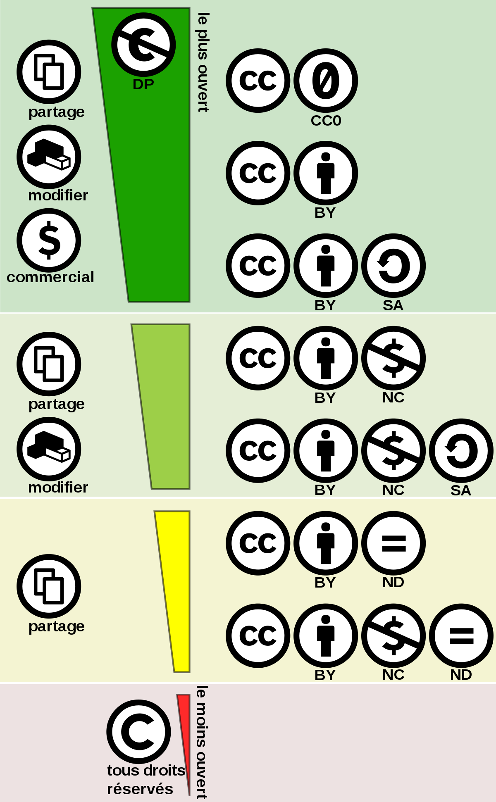

---
## Les enjeux

L'_open science_

* _open access_: 
* _open source_: 
* _open data_: 

---

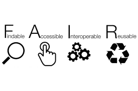

---
# Chaîne de traitement
---
## Chaîne de traitement

On parle de chaîne de traitement (ou "flux de travail" selon la Commission générale de terminologie et de néologie) ou de _workflow_.
Comme aucune solution informatique ne permet de tout faire (à l'inverse de logiciel comme _Word_ en bureautique), il faut trouver
1. Une série de solutions…
2. … qui s'articulent correctement les unes avec les autres…
3. … et qui correspondent à des standards.

---
### Un exemple de chaîne de traitement pour l'édition numérique

Source: Christof Schöch, _Digitale Textedition mit TEI_, [en ligne](https://de.dariah.eu/tei-tutorial).

---
### Philologie numérique

L'édition numérique reprend les étapes de la philologie traditionnelle. Elle ouvre de nouvelles potentialités, malheureusement au prix d'une complexification du travail.

Retour à la renaissance, ou, comme Alde Manuce, l'humaniste maîtrise l'intégralité de la chaîne de production, de la transcription à la publication, en passant par la fabrication des outils (presse, fontes…).

L'édition numérique est avant tout une édition, et nécessite des compétences en ecdotique traditionnelle.

---
### Quelques grandes étapes

1. Transcription -> Kraken, Ocropy, Tesseract…
2. Collation -> Collatex, Juxta…
3. Analyse paléographique -> Archetype…
4. Annotation linguistique -> TreeTagger, Marmot, Pie…
5. Exploitation linguistique -> TXM, Unitex/GramLab…
6. Exploitation littéraire -> Pour les emprunts: Tracer ou Philologic
7. Indexation -> HER, GROBID entity fishing…
8. Publication -> TEIPublisher, Synoptix, LaTeX
9. Archivage -> HAL, Huma-num

---
### Pourquoi dois-je (presque) tout faire?

L'objectif d'avoir un équivalent de _Word_ n'est pas nécessairement souhaitable. Toute simplification se paye:
- Au sens propre avec l'apparition de solutions privées, donc payantes.
- Au sens figuré, avec l'enfermement dans une solution générale qui gère mal les cas particuliers.

Cependant, il existe déjà des chaînes de traitement fonctionnelles et de très grande qualité, comme [METOPES](http://www.numedif.fr/metopes.html) à l'université de Caen.

---
### Quelques grands principes

1. Ouvert
2. Pérenne
3. Interopérable
---
### Un exemple d'enchaînement

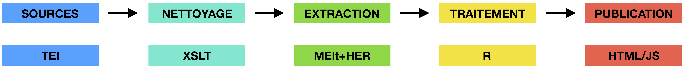

---
### Récupération des données

Le site [Dramacode](http://dramacode.github.io/) publie en ligne les transcriptions en XML-TEI

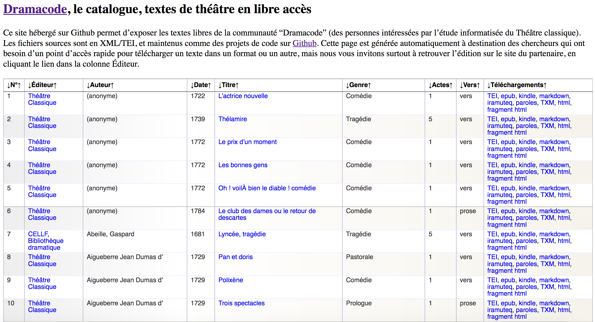

---
### La TEI

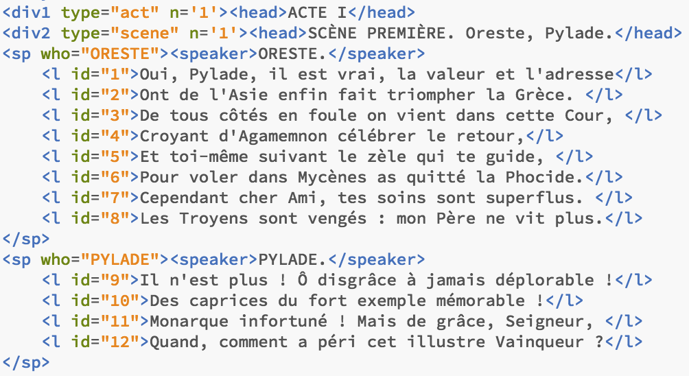

---
### Traitement avec XSLT

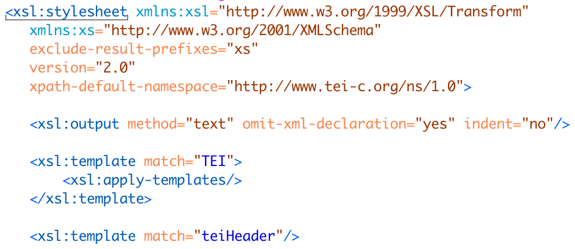

---
### Texte nettoyé

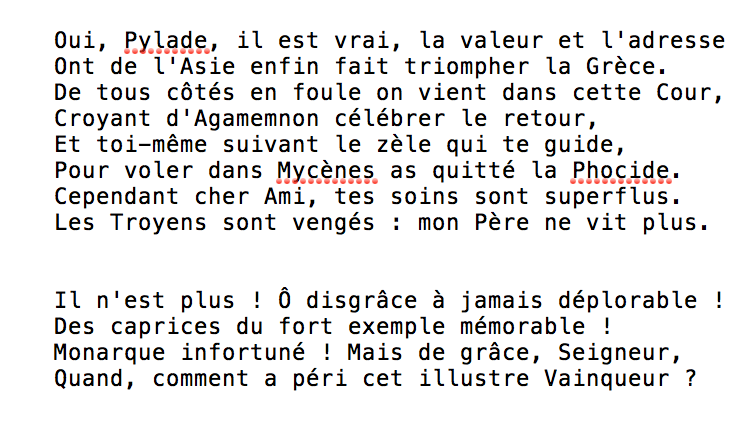

---
### Texte nettoyé

---
### Texte annoté

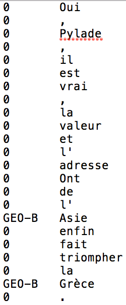

---
### Calcul des scores par pièce

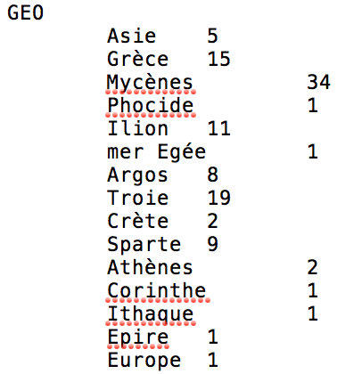

---
### Géoréférencement

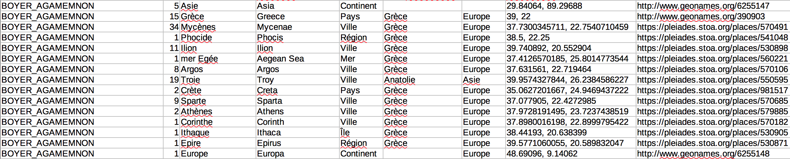

---
### Traitement

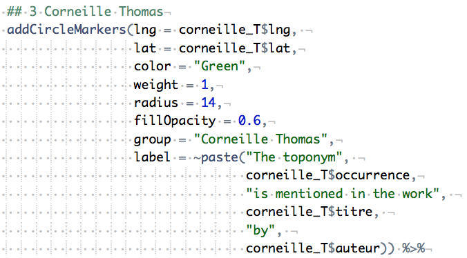

---
### Publication

---
### Analyse: Racine vs Scarron

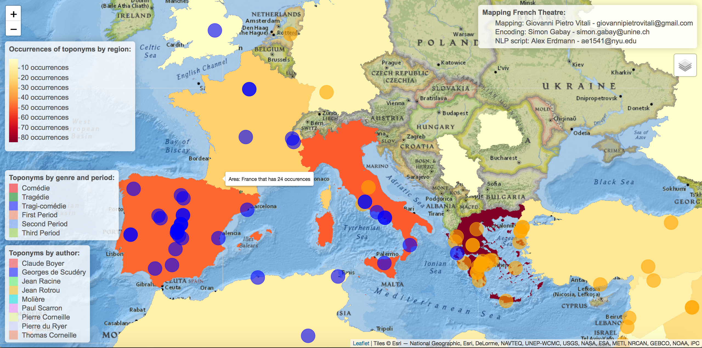

