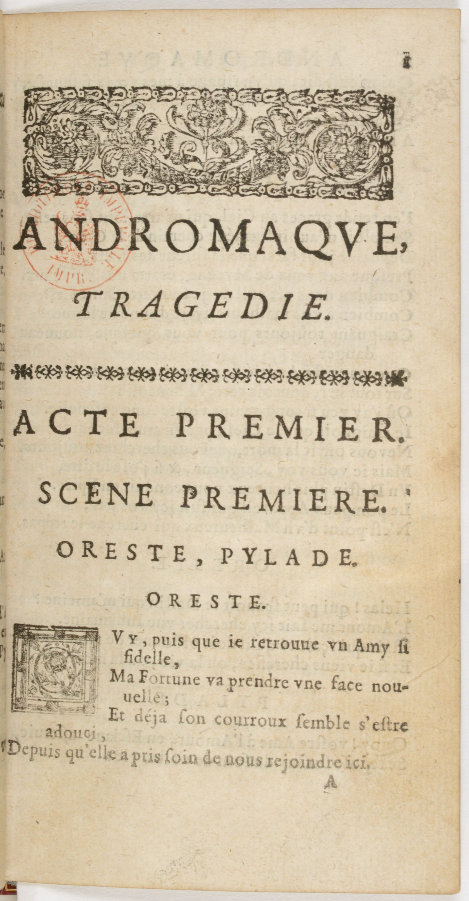
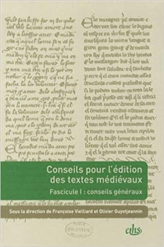
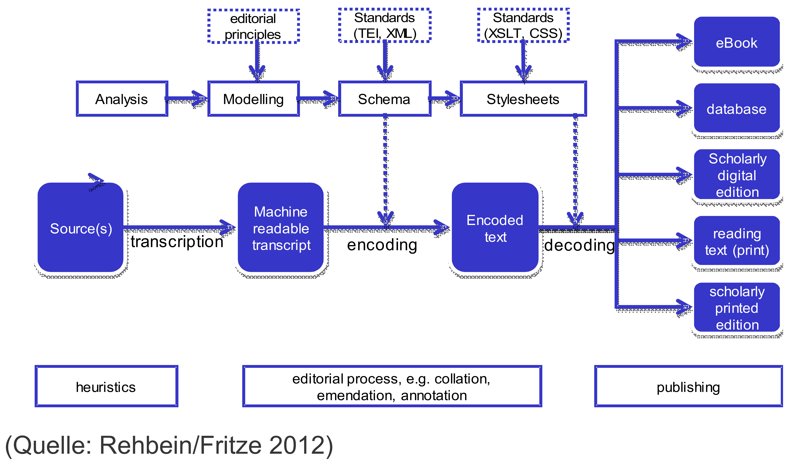

<style>
img[alt~="center"] {
  display: block;
  margin: 0 auto;
}
h1 {
  font-size: 46px;
  color: darkred;
}
h2 {
  font-size: 38px;
  color: darkred;
}
</style>

Numériser le patrimoine II: édition de texte

# Introduction à l'édition numérique

Simon Gabay

<a style="float:right; width: 20%;" rel="license" href="http://creativecommons.org/licenses/by-sa/4.0/"></a>


---
# De la philologie (ecdotique)
---
## La philologie

Il ne faut pas confondre copier, transcrire et éditer. L'édition est un art complexe et ancien: on parle d'_ecdotique_, ou de _philologie ecdotique_.

Faire de l'édition numérique, c'est donc avant tout faire de l'édition, et donc de la philologie: il est ainsi préférable d'être formé dans cette discipline.

On connaît des éditions conservatrices ou interventionnistes, diplomatiques ou interprétatives: il faut être capable de choisir.

Prenons l'exemple de la page suivante: comment l'éditer?

---

## Un cas "simple"



---

## Une solution



---
# Chaîne de traitement

---
### Philologie numérique

L'édition numérique reprend les étapes de la philologie traditionnelle. Elle ouvre de nouvelles potentialités, malheureusement au prix d'une complexification du travail.

Retour à la renaissance, ou, comme Alde Manuce, l'humaniste maîtrise l'intégralité de la chaîne de production, de la transcription à la publication, en passant par la fabrication des outils (presse, fontes…).

L'édition numérique est avant tout une édition, et nécessite des compétences en ecdotique traditionnelle.

---
## Chaîne de traitement

On parle de chaîne de traitement (ou "flux de travail" selon la Commission générale de terminologie et de néologie) ou de _workflow_.
Comme aucune solution informatique ne permet de tout faire (à l'inverse de logiciel comme _Word_ en bureautique), il faut trouver
1. Une série de solutions…
2. … qui s'articulent correctement les unes avec les autres…
3. … et qui correspondent à des standards.

---
## Un exemple de chaîne de traitement pour l'édition numérique



Source: Christof Schöch, _Digitale Textedition mit TEI_, [en ligne](https://de.dariah.eu/tei-tutorial).

---
## Encoder

Il va falloir encoder en respectant les règles de la TEI:

```xml
<div type="act" n="II" xml:id="II"><head>Acte II</head>
   <div type="scene" n="2" xml:id="II2"><head>Scène 2</head>
     <sp><speaker>Rodrigue</speaker>
         <l part="I">À moi, comte, deux mots.</l></sp>
     <sp><speaker>Comte</speaker>
         <l part="M">Parle</l></sp>
     <sp><speaker>Rodrique</speaker>
         <l part="F">Ôte-moi d'un doute</l></sp>
     <sp><speaker>Comte</speaker>
         <l part="I">Connais-tu bien Don Diègue ?</l></sp>
     <sp><speaker>Comte</speaker>
         <l part="M">Oui</l></sp>
     <sp><speaker>Rodrigue</speaker>
       <l part="F">Parlons bas, écoute.</l>
       <l>Sais-tu que ce vieillard fut la même vertu,</l>
       <l>La vaillance et l'honneur de son temps ? Le sais-tu ?</l></sp>
    ...
   </div>
 ...
 </div>
 ```

---
## Collationner

On peut avoir différentes version d'un même texte. Comme il  n'en faut qu'une seule, il va falloir collationner les différentes versions:

| A | The | quick | brown fox jumps over the | -    | dog. |
|---|-----|-------|--------------------------|------|------|
| B | The | -     | brown fox jumps over the | lazy | dog. |

---
## Documenter

Il est fondamental de documenter ses choix: quelles balises a-t-on utilisé? Pourquoi? Pour cela on utiliser un ODD (_One document does it all_).
```xml
<schemaSpec ident="T​BEcustom" start="T​EI" prefix="tei_" targetLang="en" docLang="en">
<!-- required minimal header elements -->
<moduleRef key="header" include="tei​Header file​Desc title​Stmt publication​Stmt source​Desc"/>
<!-- required core elements (p and title for use in titleStmt) -->
<moduleRef key="core" include="p title"/>
<!-- required textstructure elements (TEI, text, and body) -->
<moduleRef key="textstructure" include="T​EI text body"/>
<!-- required module tei instantiates lots of classes used for further expansion of this odd -->
<moduleRef key="tei"/>
</schemaSpec>
```

---
## Contrôler

Il est fondamental de contrôler la cohérence du code en utilisant un schéma. Il existe une multitude de schéma pour le XML

```xml

  <?xml version="1.0" encoding="UTF-8"?>
  <xs:schema xmlns:xs="http://www.w3.org/2001/XMLSchema">
    <xs:element name="personne">
      <xs:complexType>
        <xs:sequence>
          <xs:element name="nom" type="xs:string" />
          <xs:element name="prenom" type="xs:string" />
          <xs:element name="date_naissance" type="xs:date" />
        </xs:sequence>
      </xs:complexType>
    </xs:element>
  </xs:schema>
  ```

  ---

## Manipuler 1

On _encode_ en TEI, on _programme_ en XSLT (ou en Pyhton, ou en R)

```xml
<xsl:stylesheet version="1.0"
 xmlns:xsl="http://www.w3.org/1999/XSL/Transform" xmlns:Det="http://Det.com">

 <xsl:output omit-xml-declaration="yes"/>

    <xsl:template match="node()|@*">
      <xsl:copy>
         <xsl:apply-templates select="node()|@*"/>
      </xsl:copy>
    </xsl:template>

    <xsl:template match="Det:EmpExperience"/>
</xsl:stylesheet>
```

---

## Manipuler 2

On peut utiliser un autre langage spécifique au XML: le xQuery

```xquery
for $x in doc("books.xml")/bookstore/book
where $x/price>30
order by $x/title
return $x/title
```

---

## Publier

xQuery est notamment utilsé par TEI publisher. Un bon exemple est celui du projet _Démêler le cordel_:

https://desenrollandoelcordel.unige.ch/


