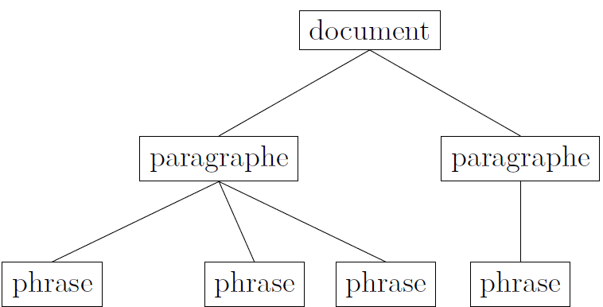

Formation Edition numérique

# Le XML, la TEI

Simon Gabay

---
## XML
---

### Le XML
XML signifie _Extensible Markup Language_. C’est un langage de balisage (vs langage de programmation, de définition de données ou de requête). Comme tout langage, il est régi par des règles.

Plus d'informations sur [Wikipedia](https://fr.wikipedia.org/wiki/Extensible_Markup_Language)

---

### Les principales règles

Ce langage de balisage fonctionne de manière simple
`XML
    <élément attribut="valeur">donnée</élément>
`
1. Un `<élément>` est entre chevrons
2. Une `<balise>` doit être fermé `</balise>`
3. Une `<balise1>` ne doit `<balise2>` pas être croisée `</balise1>` avec un autre `</balise2>`
4. Une `<balise/>` peut être auto-fermante
5. Un `<élément>` peut porter un `@attribut` (noté
avec un `@`)
6. L’@attribut` a une "valeur" (entre guillemets)

---

### Du texte à la base de données

1. Une donnée est enfermée entre deux balises. Pour nous il s’agit de parties, de chapitres, de paragraphes, de phrases, de mots, de caractères...
2. Les données sont "emboîtées" les unes dans les autres : un document contient des paragraphes, qui contiennent des phrases, qui contiennent des mots...

3. On transforme ainsi le texte en base de données.

---

### Une structure arborescente

Exemple:

>On emploie a priori les italiques pour les termes empruntés à d’autres langues. On emploie les petites capitales pour les noms propres, comme Léopold Delisle. On emploie en revanche généralement le gras pour des raisons coupables.
On retourne à la ligne pour un nouveau paragraphe.

Structure sous-jacente:

---

### XML comme langage structuré (par des balises)

`XML
<document>
  <paragraphe>
    <phrase>
      On emploie <locutionÉtrangère>a
      priori</locutionÉtrangère> les italiques pour les
      termes empruntés à d’autres langues.
    </phrase>
    <phrase>
    On emploie les petites capitales pour les noms
    propres,comme <nom>Léopold Delisle</nom> ou
    <nom>Jules Quicherat</nom>.
    </phrase>
    <phrase>
      On emploie en revanche généralement le gras pour
      des raisons coupables.
    </phrase>
  </paragraphe>
  <paragraphe>
    <phrase>
      On retourne à la ligne pour un nouveau paragraphe.
    </phrase>
  </paragraphe>
</document>
`
---

### Une question fondamentale

Une question fondamentale
1. Nous avons ici utilisé `<paragraphe>` ou `<phrase>`, mais nous aurions pu choisir d’autres noms.
2. Si nous étions italiens, nous aurions choisi `<paragrafo>` et `<frase>`
3. Mais alors les documents sont encodés différemment: comment choisir des noms pour les `<éléments>` et les `@attributs` communs à tous?

---
### Exercice

Exercice 1 [Disponible ici](https://github.com/gabays/Cours_Edition_Geneve/blob/master/Cours_02/Cours_02_exo/Cours_02_exo.md)

---
## TEI
---

### La TEI

- TEI pour _Text Encoding Initiative_
- Elle est créé en 1987 (donc avant internet)
- La TEI est pilotée par un consortium qui maintient et développe des recommandations pour l’encodage des textes
- Ces recommandations sont en constante évolution
- Elles sont disponibles en ligne http://www.tei-c.org/guidelines/

---

### Entre vocabulaire et langage

Il existe d’autres vocabulaires XML que la TEI, comme
- l’EAD (_Encoded Archival Description_) pour les archivistes
- le DC (_Dublin Core_) pour les bibliothécaires
- le TMX (_Translation Memory eXchange_)

Ces vocabulaires peuvent d’ailleurs être exprimés avec d’autres langages (comme RDF-DC en turtle).
􏰀Pour cette raison, on parle de XML-TEI, (ainsi il a existé un SGML-TEI).

---

### Trois particularités de la TEI

1. Le vocabulaire est en anglais : on utilise une balise `<w>` (_word_) pour un `<w>mot</w>`
2. Il est limité: on ne peut (presque) pas inventer de nouvelles balises
3. Il propose autant que possible un encodage sémantique (à l’inverse de LaTeX, par exemple)

---

### Sémantique et procédural

>On emploie _a priori_ les italiques pour les locutions et termes empruntés à d’autres langues.

Procédural

`XML
On emploie <italique>a priori</italique> les italiques pour les
locutions et termes empruntés à d’autres langues.
`
Sémantique

`XML
On emploie <locutionEtrangère>a priori</locutionEtrangère> les
italiques…
`
Sémantique II
`XML
On emploie <latin>a priori</latin> les italiques...
``

---

### En TEI

`XML
On emploie <foreign xml:lang="la">a priori</foreign> les
italiques...
`

---

# Quelques concepts

---

### Modélisation

> Opération par laquelle on établit le modèle d’un système complexe, afin d’étudier plus commodément et de mesurer les effets sur ce système des variations de tel ou tel de ses éléments composants.

J. Giraud, P. Pamart, J. Riverain, _Les nouveaux mots «dans le vent»_, Paris, France, 1974.

Il s’agit de définir un modèle adapté :
1. aux documents que l’on édite
2. à nos questions de recherche
3. aux moyens (techniques, financiers. . . ) dont on dispose

Attention ! Il est souvent coûteux et compliqué de revenir sur certains choix. Il s’agit donc de bien réféchir !

---

### Modélisation pour un philologue

Concrètement, pour un philologue, les premières questions sont les suivantes:
- Quels passages du texte doivent être balisés ? Les noms ? les locutions étrangères ? tous les mots ? Doit-on mettre la catégorie morpho-syntaxique et le lemme ?
- Doit-on représenter la structure physique du document (folios, pages. . . ) ou la structure logique (chapitres, parties. . . )

Attention, il est (presque) impossible de tout faire : il faut choisir !

---

### Modélisation: Structure logique
`XML
<document>
  <paragraphe>
    <phrase>
      On emploie a priori les italiques pour les terme
      empruntés à d’autres langues.
    </phrase>
    <phrase>
      On emploie les petites capitales pour les noms
      propres, comme Léopold Delisle ou Jules Quicherat.
    </phrase>
   </paragraphe>
  </document>
`

---

### Modélisation: Structure physique

`XML
<document>
  <pb n="1"/>
  On emploie a priori les italiques pour les termes
  empruntés à d’autres langues. On
  <pb n="2"/>
  emploie les petites capitales pour les noms propres,
  comme Léopold Delisle ou Jules Quicherat.
</document>
`

---

### Granularité
> Degré de finesse ou précision d’un modèle, conçu comme le niveau de son plus petit composant. Plus la granularité est grande, plus on descend dans la modélisation (niveau phrase, mot, graphème, etc.) – et plus on ajoute de balises.

---

Faible granularité
`XML
<document>
  <paragraphe>
    <phrase>
      On emploie a priori les italiques pour les termes
      empruntés à d’autres langues.
    </phrase>
    <phrase>
      On emploie les petites capitales pour les noms
      propres, comme Léopold Delisle ou Jules Quicherat.
    </phrase>
   </paragraphe>
</document>
`

---

Moyenne granularité
`XML
<document>
  <paragraphe>
    <phrase>
      On emploie <locutionÉtrangère>a
      priori</locutionÉtrangère> les italiques pour les
      termes empruntés à d’autres langues.
    </phrase>
    <phrase>
      On emploie les petites capitales pour les noms
      propres, comme <nom>Léopold Delisle</nom> ou
      <nom>Jules Quicherat</nom>.
    </phrase>
   </paragraphe>
`

---

Forte granularité
`XML
<document>
  <paragraphe>
    <phrase>
      <w lemme="on" POS="PROper">On<w/>
      <w lemme="employer" POS="VERcjg">emploie<w>
     ...
`

---
### Exercices

Exercice 2 et 3 [Disponible ici](https://github.com/gabays/Cours_Edition_Geneve/blob/master/Cours_02/Cours_02_exo/Cours_02_exo.md)

---
### Sources

Ce cours reprend des parties d'un cours donné avec J.-B. Camps à Neuchâtel en février 2018.
