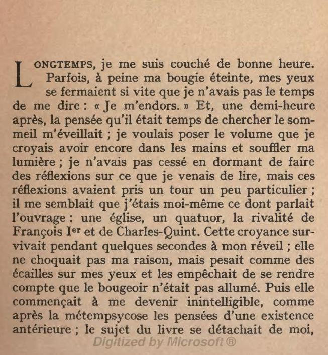
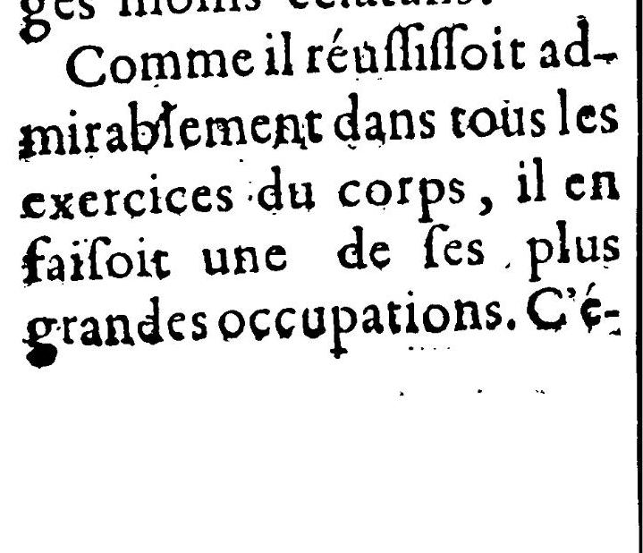
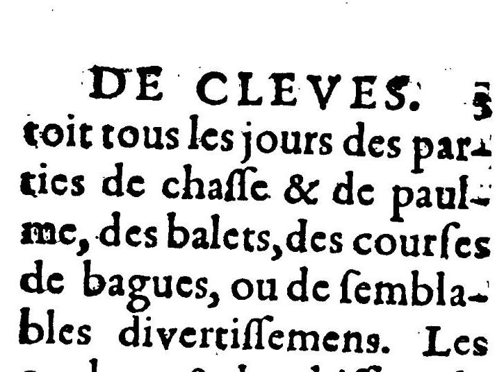
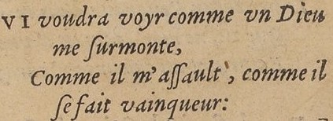
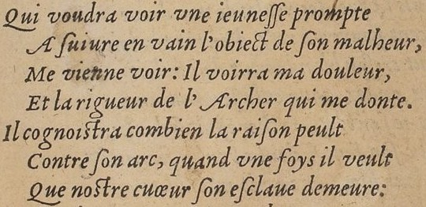
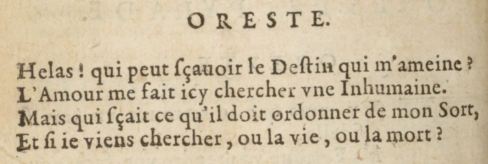
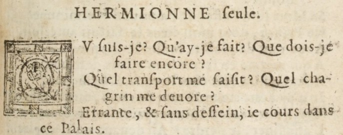

Formation Edition numérique

# Le texte

Simon Gabay


---
# Les bases
---
## Le paragraphe

Le paragraphe s'encode avec la balise `<p>`




```XML
<p>Longtemps, je me suis couché de bonne heure. Parfois,
à peine ma bougie éteinte, mes yeux se fermaient si vite
que je n’avais pas le temps de me dire : « Je m’endors. »
Et, une demi-heure après, la pensée qu’il était temps de
chercher le sommeil m’éveillait ; je voulais […]</p>
```
---
## La page

Pour encoder le changement de page, on utilise la balise `<pb/>`. Remarquons que cette balise est auto-fermante, pour éviter les chevauchements




```XML
Comme il réuſſiſſoit admirablement dans tous les
exercices du corps, il en faiſoit une de ſes plus grandes
occupations. C’é-<pb n="3"/>toit tous les jours des parties
de chaſſe &amp; de paulme, des balets, des courſes de
bagues, ou de ſemblables divertiſſemens.
```
---
## La structure en `<div>`

On regroupe du texte, peu importe pour quelle raison, avec la balise `<div>`. Ainsi la structure suivante:

```YAML
livre:
  -préface
  -introduction
  -chapitre 1
  -chapitre 2
  -postface
```

Est encodée ainsi:

```XML
<div>
  <div>préface</div>
  <div>introduction</div>
  <div>chapitre 1</div>
  <div>chapitre 2</div>
  <div>postface</div>
</div>
```

---

```YAML
livre:
  -partie 1
    chapitre 1
    chapitre 2
    chapitre 3
  -partie 2
    chapitre 1
    chapitre 2
    chapitre 3
```

```YAML
recueil:
  -poème 1
  -poème 2
  -poème 3
```

```YAML
pièce:
  -acte 1
    scène 1
    scène 2
  -acte 2
    scène 1
    scène 2
```

---
On reproduit cette logique pour tous les types:

```XML
<div>
  <div>
    <head>préface</head>
     <p>…</p>
     <p>…</p>
  </div>
  <div>
    <head>introduction</head>
     <p>…</p>
     <p>…</p>
  </div>
  <div>
    <head>chapitre 1</head>
     <p>…</p>
     <p>…</p>
     <p>…</p>
  </div>
  <div>
    <head>chapitre 2</head>
     <p>…</p>
     <p>…</p>
  </div>
</div>
```

---
### Les entités

Le signe ```&``` comme le signe ```<``` appartiennent au code et doivent donc être _échappés_.
1. ```<``` signale le début d'une balise, et ne peut donc signifier aussi "plus petit que". Pour ce dernier sens, il faut utiliser ```&lt;```
2. Une entité de caractère commence par ```&``` et finit par ```;``` (```&lt;``` pour "plus petit que", ```&gt;``` pour "plus grand que"… Il est donc impossible d'utiliser ```&```  et il faut utiliser ```&amp;```

_& tu m'as vu depuis_ est donc transcrit:

```XML
&amp; tu m'as vu depuis
```

---
# Le vers
---
## Le vers
Il ne faut pas confondre un vers (`<l>`) avec un retour à la ligne (`<lb/>`)




```XML
<l>QVI voudra voyr comme vn Dieu
  <lb/> me ſurmonte,</l>
<l>Comme il m'aſſault, comme il
  <lb/>ſe fait vainqueur:</l>
```

---
## La strophe

On encode les strophes avec `<lg>`. Regardez les `@attributs`.



```XML
<lg n="1" type="quatrain">
  <l n="1">Qui voudra voir une ieuneſſe prompte</l>
  <l n="2">A ſuivre en vain l'obiect de ſon malheur,</l>
  <l n="3">Me vienne voir: Il voirra ma douleur,</l>
  <l n="4">Et la rigueur de l'Archer qui me donte.</l>
</lg>
<lg n="2" type="tercet">
  <l n="5">Il cognoistra combien la raiſon peult</l>
  <l n="6">Contre ſon arc, quand vne fois il veult</l>
  <l n="7">Que nostre cuœur ſon eſclaue demeure:</l>
</lg>
```
---
## Le mot

On peut aussi encoder au niveau du mot avec `<w>`, par exemple pour la rime:

```XML
<l>QVI voudra voyr comme vn Dieu
  <lb/> me <w rhyme="a">ſurmonte</w>,</l>
<l>Comme il m'aſſault, comme il
  <lb/>ſe fait <w rhyme="b">vainqueur</w>:</l>
```
Notons que, en TEI, il existe plusieurs manières de faire la même chose:

```XML
<lg ryhme="ab">
  <l>QVI voudra voyr comme vn Dieu
    <lb/> me <rhyme label="a">ſurmonte</rhyme>,</l>
  <l>Comme il m'aſſault, comme il
    <lb/>ſe fait <rhyme label="b">vainqueur</rhyme>:</l>
</lg>
```

---
# Le Théâtre
---
## La prise de parole



On peut encoder les prises de paroles avec `<sp>`

```XML
<sp>
  ORESTE.
  <lg>
    <l>Helas ! qui peut ſçauoir le Deſtin qui m’ameine ?</l>
    <l>L’Amour me fait icy chercher vne Inhumaine.</l>
    <l>Mais qui ſçait ce qu’il doit ordonner de mon Sort,</l>
    <l>Et ſi ie viens chercher, ou la vie, ou la mort ?</l>
  </lg>
</sp>
```
---
## Le nom du personnage qui parle
On peut encoder le nom du personnage qui parle avec `<speaker>`

```XML
<sp who="oreste">
  <speaker>ORESTE.</speaker>
  <lg>
    <l>Helas ! qui peut ſçauoir le Deſtin qui m’ameine ?</l>
    <l>L’Amour me fait icy chercher vne Inhumaine.</l>
    <l>Mais qui ſçait ce qu’il doit ordonner de mon Sort,</l>
    <l>Et ſi ie viens chercher, ou la vie, ou la mort ?</l>
  </lg>
</sp>
```
---
## La didascalie

Pour les didascalies, on va utiliser la balise `<stage>`



```XML
<sp>
  <speaker>HERMIONNE</speaker> <stage>ſeule.</stage>
  <l>Ov ſuis-je ? Qu’ay-je fait ? Que dois-je faire encore ?</l>
  <l>Quel tranſport me ſaiſit ? Quel chagrin me deuore ?</l>
  <l>Errante, &amp; ſans deſſein, ie cours dans ce Palais.</l>
  <l>Ah ! ne puis-je ſçauoir ſi j’aime, ou ſi ie hais !</l>
</sp>
```

---
## L'antilabe

L'antilabe est le morcellement du vers sur plusieurs répliques. Il est possible de le signaler avec l'attribut `@part` et les valeur `I` (_initial_), `M` (_Middle_) ou `F` (_Final_).

```xml
<sp>
  <speaker>PYLADE.</speaker>
  <lg>
    <gap reason="sampling"/>
    <l part="I">Il vient.</l>
  </lg>
</sp>
<sp>
  <speaker>ORESTE.</speaker>
  <lg>
     <l part="F">Hé bien, va donc diſpoſer la Cruelle</l>
     <l>A reuoir vn Amant qui ne vient que pour elle.</l>
  </lg>
</sp>
```
