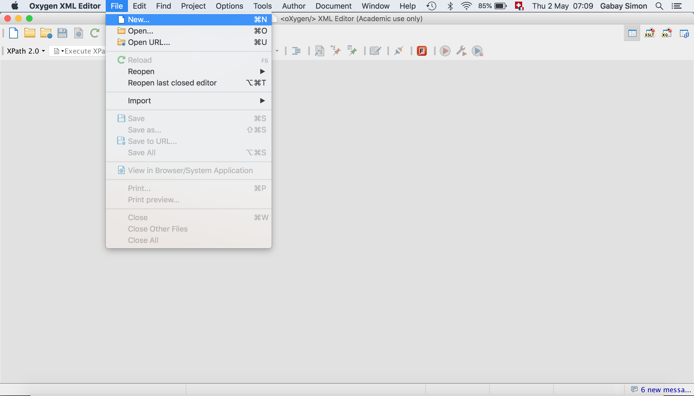
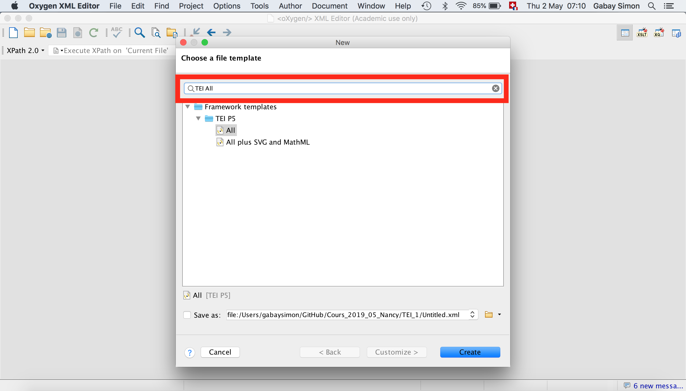
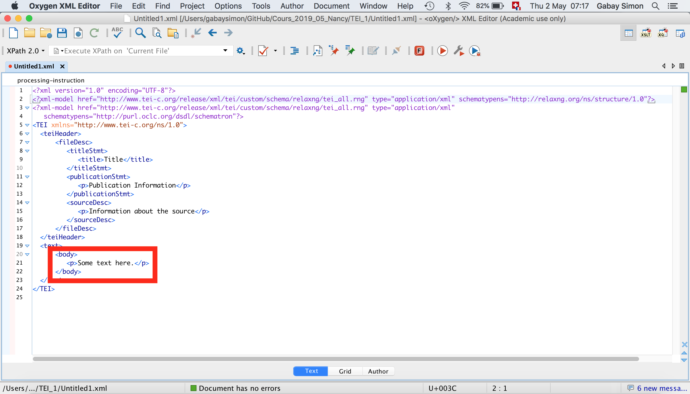

Formation Edition numérique

# Le texte

Simon Gabay


---
## Exercice 1: un premier document XML-TEI

Créez votre premier document TEI.
1. Ouvrez Oxygen
2. Fichier>Nouveau



---
3. Une fenêtre s'ouvre Tapez "TEI P5 All" dans le champ de recherche, puis "Créer"



---
4. vous avez votre document TEI minimal. Vous n'allez travailler que sur la partie en rouge



---
5. Remplacez le contenu de ```<text>``` par la transcription sachant que

	5.1 Un poème est contenu dans une balise ```<div>```

	5.2 Un titre est contenu dans une balise ```<head>```

	5.3 Une strophe est contenue dans une balise ```<lg>```

	5.4 Un vers est contenu dans une balise ```<l>```

6.  Si vous avez fini, vous pouvez utiliser des attributs

	6.1 L'élément ```<div>``` peut porter un attribut ```@type```. Dites que c'est un sonnet.

	6.2 L'élément ```<lg>``` peut porter un attribut ```@rhyme```. Précisez le schéma des rimes (_ABBA ABBA CCD_ …)

	6.3 Vous pouvez identifier les mots à la rime avec l'élément ```<rhyme>```, et un attribut ```@label``` permet d'identifier à quelle partie du schéma métrique le mot se rattache (_a_, _b_, _c_ ou _d_?)

  6.4 Vous pouvez numéroter les vers avec l'attribut `@n` (`<l n="1">`)

---
La transcription:

```txt
Sonetz.
QVI voudra voyr comme vn Dieu me ſurmonte,
Comme il m'aſſault, comme il ſe fait vainqueur:
Comme il r'enflamme, et et renglace mon cuœur,
Comme il reçoit un hõnneur de ma honte.

Qui voudra voir une ieuneſſe prompte
A ſuivre en vain l'obiect de ſon malheur,
Me vienne voir: Il voirra ma douleur,
Et la rigueur de l'Archer qui me donte.

Il cognoistra combien la raiſon peult
Contre ſon arc, quand vne fois il veult
Que nostre cuœur ſon eſclaue demeure:

Et ſi voirra que ie ſuis trop heureux,
D'auoir au flanc l'aiguillon amoureux,
Plein du venin dont il fault que ie meure.
```
