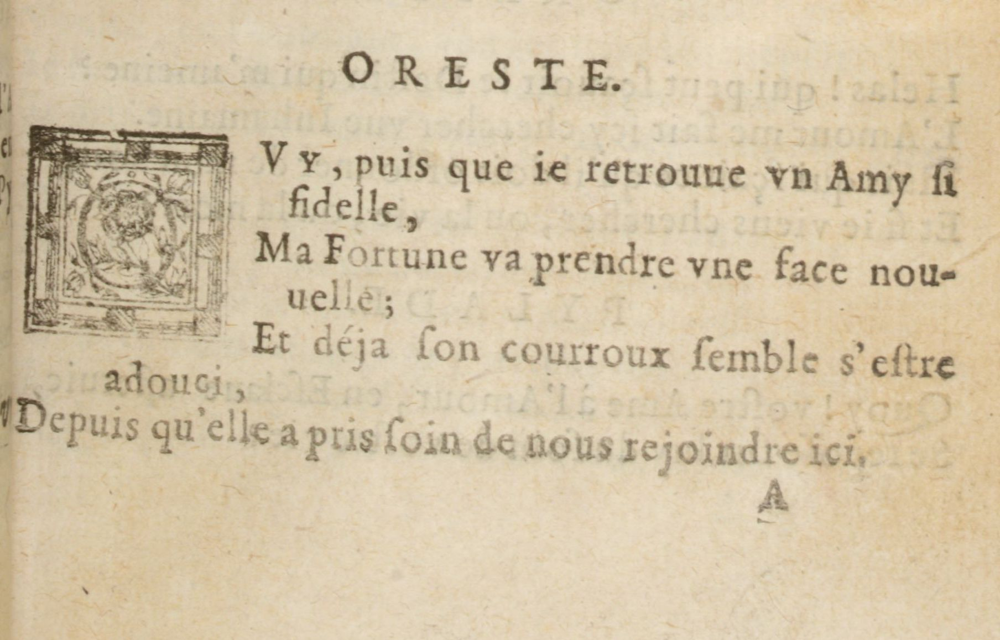
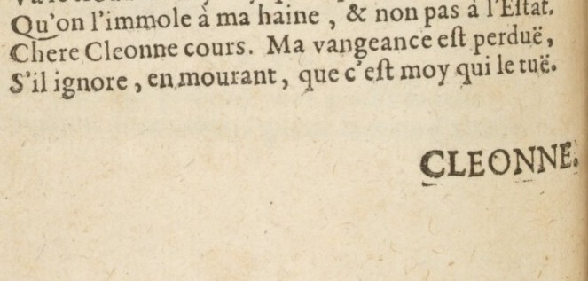
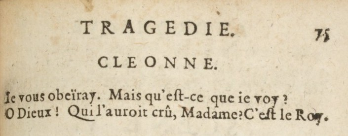

<style>
img[alt~="center"] {
  display: block;
  margin: 0 auto;
}
h1 {
  font-size: 46px;
  color: darkred;
}
h2 {
  font-size: 38px;
  color: darkred;
}
</style>

Bibliothèques numériques, II. Editions et corpus numériques

# Le texte augmenté (intervention et mise en page)

Simon Gabay

<a style="float:right; width: 20%;" rel="license" href="http://creativecommons.org/licenses/by-sa/4.0/"></a>

---
# L'Intervention éditoriale

---
## Annoter

Pour ajouter une note, on le fait à l'endroit où l'on mettrait un appel de note, avec la balise ```<note>```

```XML
<l>Hermione à Pyrrhus prodiguoit tous ses charmes</l>
<note>Voltaire imite ce chant dans la Henriade,
  chant IX: 'D’Estrée à son amant prodiguait ses
  appas'.</note>
```

Il peut être utile d'ajouter un attribut ```@type``` pour préciser le type de note
```XML
<note type="lang">morphème de l'impft -oi- typique du
XVIIe s.</note>
<note type="litt">Pylade est le cousin d'Oreste.</note>
```
---
## Normaliser le texte

Pour normaliser tout en conservant la leçon originale, il est possible de d'utiliser les balises ```<orig>``` et ```<reg>```. Elles sont souvent encadrées par une balise ```<choice>```.

```XML
<l>
  <orig>Hermione a Pyrrhus prodiguoit tous…</orig>
  <reg>Hermione à Pyrrhus prodiguait tous…</reg>
</l>
```

On peut aussi opérer au niveau du mot

```XML
<choice>
  <orig>prodiguoit</orig>
  <reg>prodiguait</reg>
</choice>
```

Ou au nivau de la lettre

```XML
prodigu<choice><orig>o</orig><reg>a</reg></choice>it
```
---
### Développer l'abréviation

Il est possible de développer les abbréviations

```XML
Pylade est un hõme
Pylade est un h<ex>om</ex>me
```

Au cas où l'on perd de l'information lors du développement de l'abréviation, on peut aussi la conserver avec un ```<choice>```

```XML
Pylade est un
<choice>
  <abbr>hõme</abbr>
  <expan>homme</expan>
</choice>
```
---
### Corriger le texte

Il est possible de corriger le texte

```XML
Pylade est un home
Pylade est un hom<corr>m</corr>e
```

Au cas où l'on perd de l'information lors de la correction, on peut aussi la conserver avec un ```<choice>```

```XML
Pylade est un
<choice>
  <sic>home</sic>
  <corr>homme</corr>
</choice>
```

En cas d'oubli manifeste, on peut toujours rajouter un mot avec `<supplied>`:

```XML
Pylade un homme
Pylade <supplied>est</supplied> un homme
```

---
# La mise en page

---
<style scoped>
table {
    height: 100%;
    width: 100%;
    font-size: 20px;
    margin-bottom: -10px;
    padding-bottom: -10px;
}
div.twocols {
  margin-top: 35px;
  column-count: 2;
}
div.twocols p:first-child,
div.twocols h1:first-child,
div.twocols h2:first-child,
div.twocols ul:first-child,
div.twocols ul li:first-child,
div.twocols ul li p:first-child {
  margin-top: 0 !important;
}
div.twocols p.break {
  break-before: column;
  margin-top: 0;
}
</style>
<div class="twocols">

## Analyse la page

Il existe un lexique pour analyser la page qu'il est utile de maîtriser (minimalement)

* En rouge nous avons le numéro de page
* En vert nous avons le bandeau orné (motifs végétaux)
* En jaune un autre bandeau, qui est une frise de fleurons
* En violet une lettre initiale ornée
* En bleu la signature de cahier

<p class="break"></p>


</div>

---
<style scoped>
table {
    height: 100%;
    width: 100%;
    font-size: 20px;
    margin-bottom: -10px;
    padding-bottom: -10px;
}
div.twocols {
  margin-top: 35px;
  column-count: 2;
}
div.twocols p:first-child,
div.twocols h1:first-child,
div.twocols h2:first-child,
div.twocols ul:first-child,
div.twocols ul li:first-child,
div.twocols ul li p:first-child {
  margin-top: 0 !important;
}
div.twocols p.break {
  break-before: column;
  margin-top: 0;
}
</style>

<div class="twocols">

* En bleu nous avons le titre courant
* En vert nous avons un cul-de-lampe de fleurons
* En rouge la réclame (premier mot de la page suivante, située sur un nouveau cahier)

<p class="break"></p>


</div>

---
## Elément de mise en page

Tous les éléments de mise en page (titre courant, réclame, signature de cahier…) sont encodés avec la balise `<fw>`



```xml
<sp>
 <speaker>ORESTE</speaker>
 <l>OVY, puis que ie retrouue vn Amy ſi
   <lb/>fidelle,</l>
 <l>Ma fortune va prendre vne face nou-
   <lb/>uelle;</l>
 <l>Et déja ſon courroux ſemble s'eſtre
   <lb/>adouci,</l>
 <l>Depuis qu'elle a pris ſoin de nous rejoindre ici.</l>
 <fw>A</fw>
```

---
<style scoped>
table {
    height: 100%;
    width: 100%;
    font-size: 20px;
    margin-bottom: -10px;
    padding-bottom: -10px;
}
div.twocols {
  margin-top: 35px;
  column-count: 2;
}
div.twocols p:first-child,
div.twocols h1:first-child,
div.twocols h2:first-child,
div.twocols ul:first-child,
div.twocols ul li:first-child,
div.twocols ul li p:first-child {
  margin-top: 0 !important;
}
div.twocols p.break {
  break-before: column;
  margin-top: 0;
}
</style>


## Distinction des éléments de mise en page

Comme l'élément `<fw>` peut encoder de nombreuses choses, il est possible de:
* regrouper tout dans un même `<fw>`
```xml
<fw><lb/>CLEONNE
  <lb/>TRAGEDIE 75</fw>
```
* Distinguer plusieurs `<fw>` avec des `@type`
```xml
<fw type="catchword" place="bot-right">CLEONNE</fw>
<fw type="runningTitle" place="top-centre">TRAGEDIE</fw>
<fw type="pageNum" place="top-right">75</fw>
```

<div class="twocols">



<p class="break"></p>


</div>

---
## Mise en évidence

Certains passages sont mis en évidence de plusieurs manières: gras, italique, majuscules, exposant… Il est possible pour cela d'utiliser la balise `<hi>`


```xml
<speaker>ORESTE</speaker>
<lb/><hi>O</hi><hi>VY</hi>, puis que ie retrouue vn Amy ſi
<lb/>fidelle,
<lb/>Ma Fortune va prendre vne face nou-
<lb break="no"/>uelle;
<lb/>Et déja ſon courroux ſembe s'eſtre adouci,
<lb/>Depuis qu'elle a pris ſoin de nous rejoindre ici.
```

---
# Les attributs

---
### `@rend`

Il est possible d'encoder la mise en page avec l'aide d'attributs comme `@rend` (_rendition_). Des valeurs classiques sont: `italic`, `bold`, `uppercase`, `strikethrough`…


```xml
<speaker>ORESTE</speaker>
<lb/><hi rend="initiale">O</hi><hi rend="upper">VY</hi>, puis que ie retrouue vn Amy ſi
<lb/>fidelle,
<lb/>Ma Fortune va prendre vne face nou-
<lb break="no"/>uelle;
<lb/>Et déja ſon courroux ſembe s'eſtre adouci,
<lb/>Depuis qu'elle a pris ſoin de nous rejoindre ici.
```

---
### `@place`

Il est possible d'encoder la position avec l'attribut `@place`. Des valeurs classiques sont : `top-right`, `bot-left` (ou `bottom-left`), `top-center`…


```xml
<fw type="runningTitle" place="top-centre">TRAGEDIE</fw>
<fw type="pageNum" place="top-right">75</fw>
<sp>
  <speaker rend="center">ORESTE.</speaker>
  <lb/>Ie vous obïray. Mais qu'eſt-ce que ie voy?
  <lb/>O Dieux! Qui l'auroit crû, Madame? C'eſt le Roy.

```
