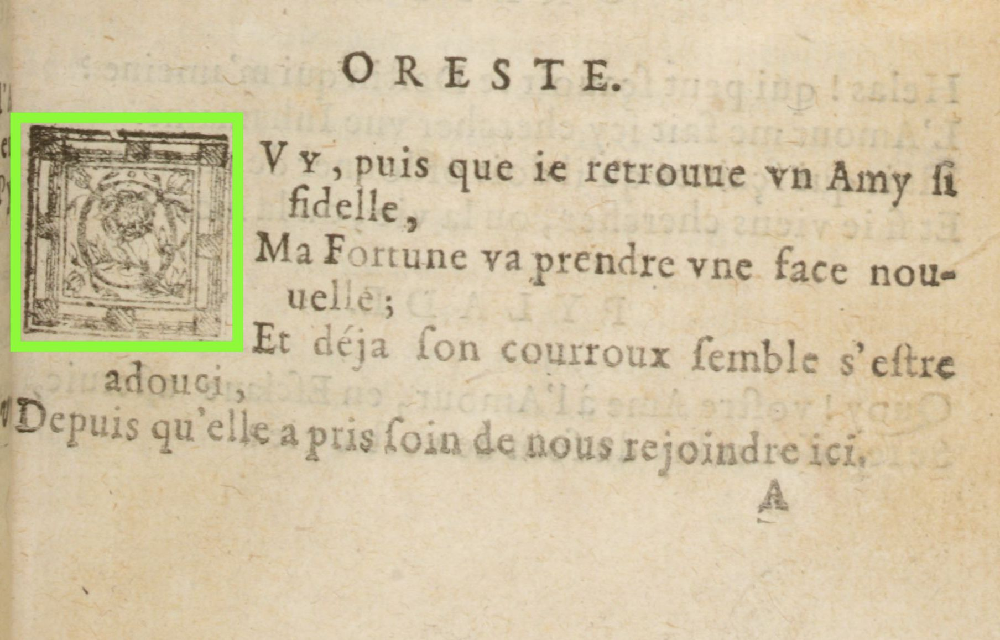
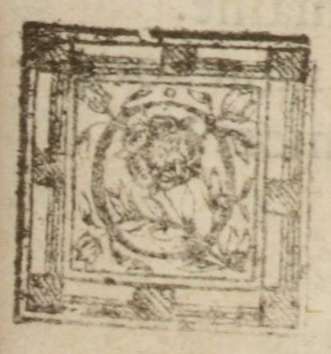
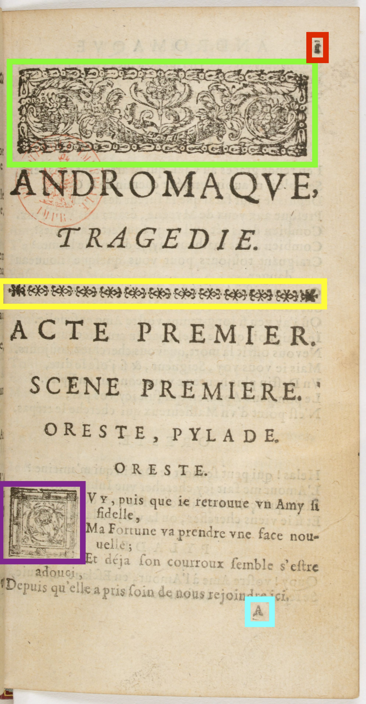

Formation Edition numérique

# La mise en page (et les pointeurs)

Simon Gabay


---
# L'image

---
## La page

Il est possible de lier le début de la page (`<pb>`) à l'image de la page. On le fait avec l'attribut `@facs`

```xml
<pb facs="chemin/vers/image"/>
```

Le chemin peut être une url (de préférence un permalien
```xml
<pb facs="https://gallica.bnf.fr/ark:/12148/btv1b8610810z/f90.item"/>
```

Le chemin peut être celui vers un fichier conservé sur l'ordinateur.
```xml
<pb facs="image.jpg"/>
```

---
## Excursus: la notion de chemin

Prenons un dossier contenant une image

```YAML
DOSSIER
  |-fichier.xml
  |-image_1.jpg
  |-image_2.jpg
```
Le chemin de `fichier.xml` à `image_1.jpg` est `image_1.jpg`.

Souvent, si l'on a plusieurs images, elles sont regroupées dans une même dossier

```YAML
DOSSIER
  |-fichier.xml
  |-IMAGES
    |-image_1.jpg
    |-image_2.jpg
```
Le chemin de `fichier.xml` à `image_1.jpg` est `IMAGES/image.jpg`.

---
Souvent, si l'on a plusieurs images, elles sont regroupées dans une même dossier

```YAML
DOSSIER
  |-fichier.xml
  |-MATERIAL
    |-IMAGES
      |-image_1.jpg
      |-image_2.jpg
    |-CSS
      |-mon.css
```
* Le chemin de `fichier.xml` à `image_1.jpg` est `MATERIAL/IMAGES/image.jpg`. D'où la convention de parler de `chemin/vers/le/fichier`.

* Il est possible de "remonter" l'arbre en utilisant `../` pour chaque niveau: la position de `fichier.xml` par rapport à `mon.css` est ainsi `../../fichier.xml`

---
## Encoder l'image

Nous pouvons avoir besoin d'encoder un morceau de page directement dans le texte. C'est notamment le cas avec une initiale: on peut alors découper l'image (appelons le fichier `initiale.jpg`), et pointer vers cet extrait dans le code avec la balise `<graphic>`

```xml
<speaker rend="center">ORESTE.</speaker>
<graphic url="initiale.jpg"/>OVY, puis que ie retrouue vn Amy ſi
<lb/>fidelle,
<lb/>Ma fortune va prendre vne face nou
<lb break="no"/>uelle;
<lb/>Et déja ſon courroux ſemble s'eſtre
<lb/>adouci,
<lb/>Depuis qu'elle a pris ſoin de nous rejoindre ici.
```





---
## Encoder un peu plus que l'image

Il est possible de faire un peu mieux que l'utilisation de `<graphic>` en y associant une légende avec `<figDesc>`. On regroupe alors le tout dans `<figure>`.


```xml
<speaker rend="center">ORESTE.</speaker>
<lb/><figure>
  <graphic url="initiale.jpg"/>
  <figDesc>Initiale ornée</figDesc>
</figure> <hi rend="initiale">O</hi>VY, puis que ie retrouue vn Amy
<lb/>fidelle,
<lb/>Ma Fortune va prendre vne …
```
---
## Dans la page



Plutôt qu'à la page complète, on peut avoir besoin de faire référence à une partie de la page uniquement: le bandeau, la frise, l'initiale… On va donc:

* Regrouper tous les chemins vers les images dans une balise `<facsimile>` (qui rappelle l'attribut `@facs`)
* Regrouper tout ce qui est relatif à une même page dans une balise `<surface>`.
* Distinguer l'image entière, qui est dans `<graphic>`
* et des zones de cette image dans une balise `<zone>`
* Ces zones sont définies par des coordonnées

---

```xml
  …
</teiHeader>
<facsimile>
   <surface>
      <graphic url="img1.jpg"/>
      <zone xml:id="img1_bandeau" lry="870" lrx="1683" uly="356" ulx="83"/>
      <zone xml:id="img1_frise" lry="1650" lrx="1746" uly="1523" ulx="30"/>
      <zone xml:id="img1_initiale" lry="3053" lrx="440" uly="2633" ulx="43"/>
   </surface>
   <surface>
      …
   </surface>
</facsimile>
<text>
  …
```

Toutes ces informations sont placées entre
* le `<teiHeader>` qui contient les métadonnées (nous y reviendrons)
 * le `<text>` qui contient les données textuelles
 * `<facsimile>` contient donc, en quelque sorte, les données graphiques.
---

```xml
<TEI xmlns="http://www.tei-c.org/ns/1.0">
  <teiHeader>
      <fileDesc>
         <titleStmt>
            <title>Title</title>
         </titleStmt>
         <publicationStmt>
            <p>Publication Information</p>
         </publicationStmt>
         <sourceDesc>
            <p>Information about the source</p>
         </sourceDesc>
      </fileDesc>
  </teiHeader>
   <facsimile>
      <graphic url="image.jpg"></graphic>
   </facsimile>
  <text>
      <body>
         <p>Some text here.</p>
      </body>
  </text>
</TEI>
```
---
# Système de pointage

---
## L'dentifiant unique

Lorsque nous avons encodé les `<zone>`, nous avons utilisé l'attribut `@xml:id`pour donner un nom à cette zone.

```xml
<zone xml:id="img1_initiale"
      lry="3053"
      lrx="440"
      uly="2633"
      ulx="43"/>
```

Il s'agit d'une identifiant unique: cela signifie qu'aucun autre `@xml:id` ne peut avoir le même contenu. Il n'y en a qu'un. On peut donc "pointer" vers lui à l'aide d'un pointeur, qui se matérialise par une valeur d'attribut commençant par un dièse:

```xml
<graphic url="#img1_initiale"/>
```
---
## Le mécanisme de pointage

Nous obtenons donc:


```xml
<speaker rend="center">ORESTE.</speaker>
<lb/><figure>
  <graphic url="#f19_initiale"/>
  <figDesc>Initiale ornée</figDesc>
</figure> <hi rend="initiale">O</hi>VY, puis que ie retrouue vn Amy
<lb/>fidelle,
<lb/>Ma Fortune va prendre vne …
```
---
## `@ref`

La plupart du temps, nous utilisons l'attribut `@ref` pour pointer vers un endroit. C'est notamment un moyen de normaliser une information potentiellement instable, comme les noms de lieux et de personne (`<name>`), dont le nom peuvent varier
* Car ils ont différent noms (_Ilion_ vs _Troie_, _Albion_ vs _Grande-Bretagne_)
* Car l'orthographe est instable (_Hermionne_ vs _Hermione_).

Le moyen le plus simple est de mettre un xml:id sur la première occurence, et de faire pointer toutes les autres vers elle.

```xml
Préſenteroit d'abord <name xml:id="pylade">Pylade
</name>…
<gap reason="sampling"/>
Me rendra-t'il, <name ref="#pylade">Pilade</name>,
vn Cœur qu’il m’a rauy?
<gap reason="sampling"/>
i’irois bientoſt, <name ref="#pylade">Pilad</name>,
```
