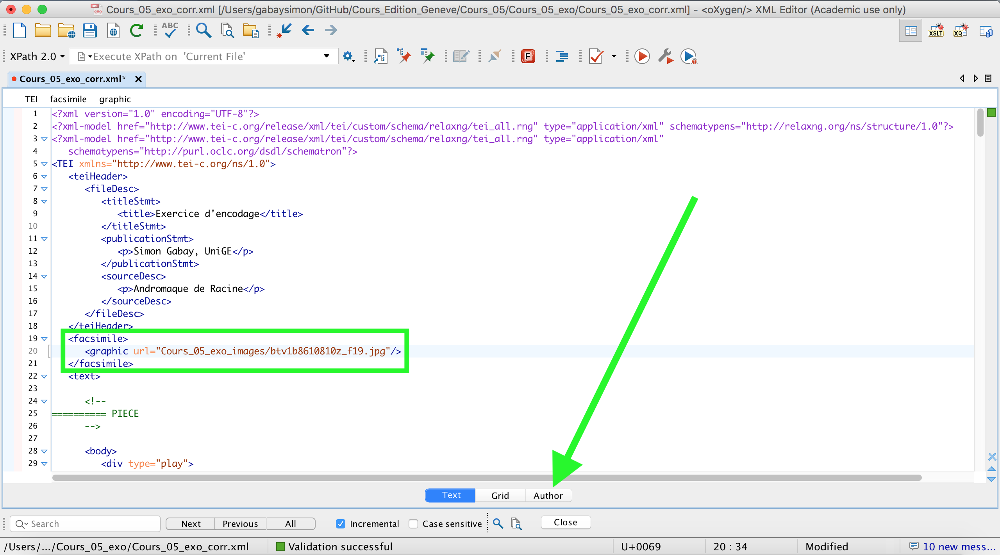
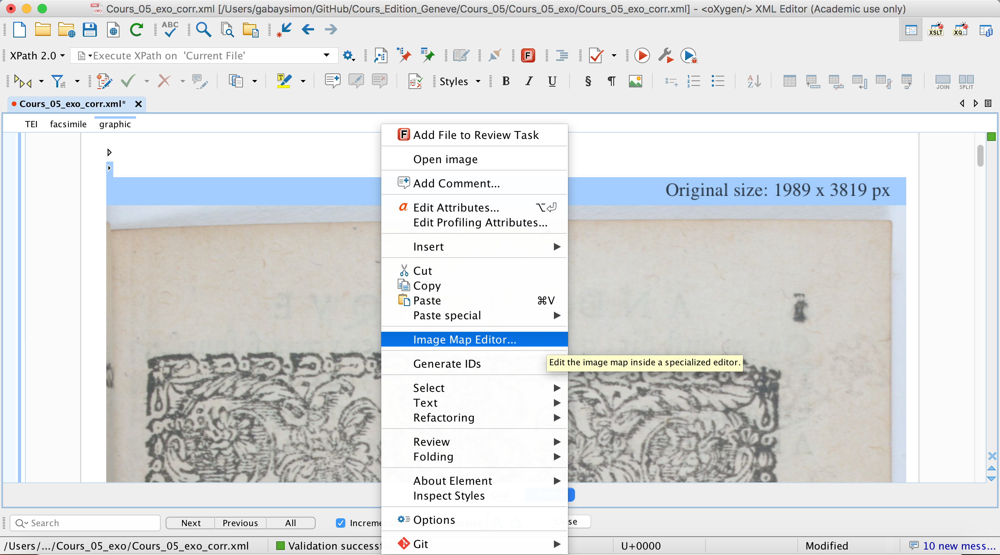
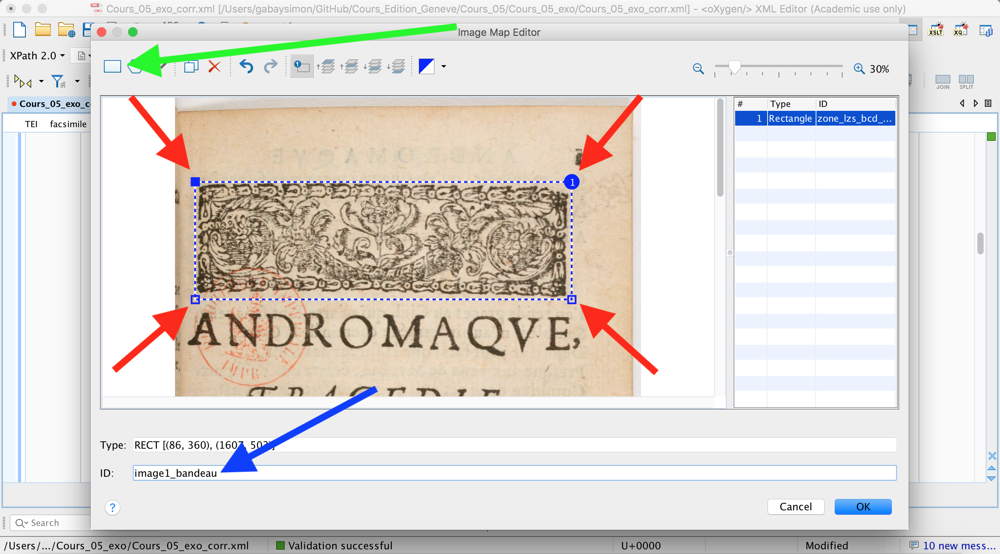
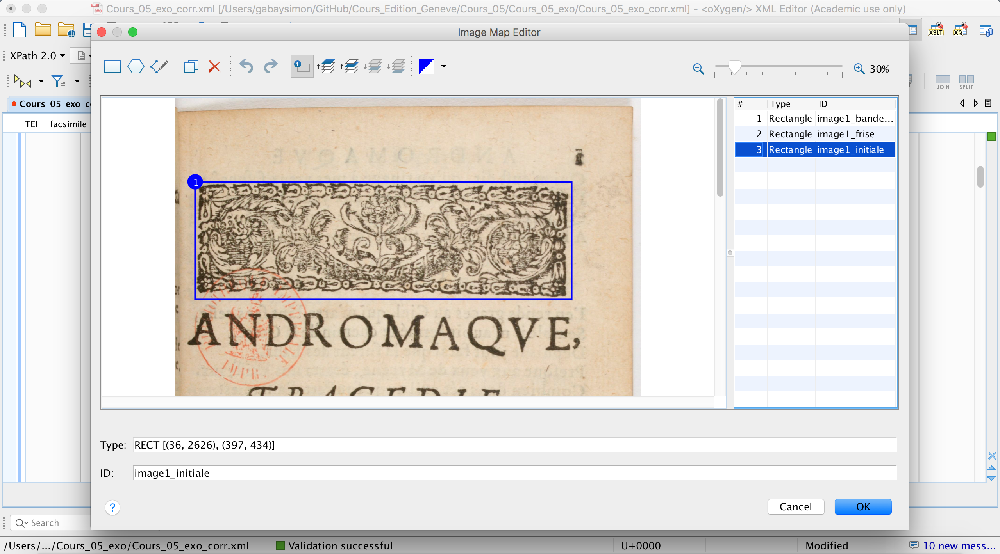
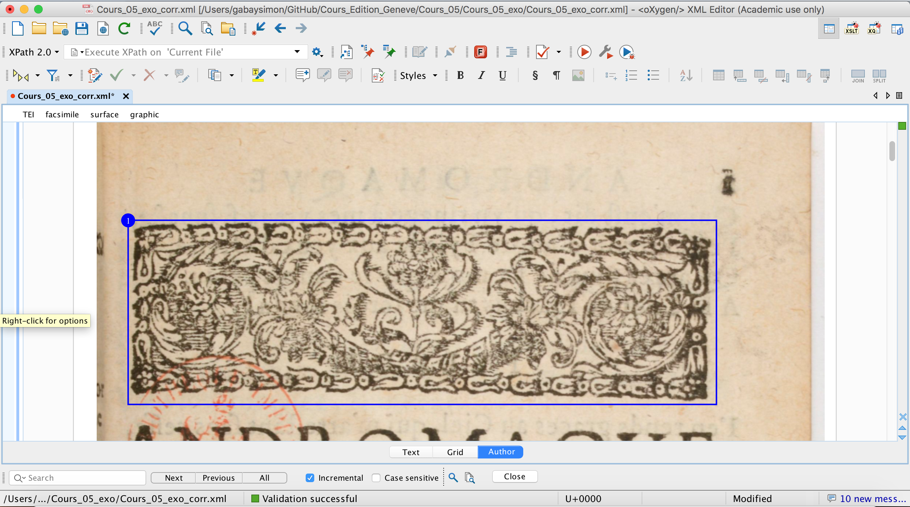
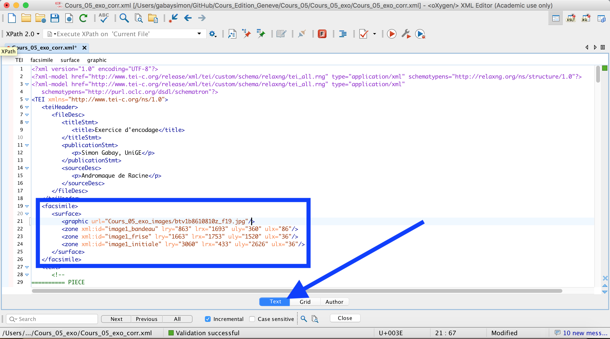

Formation Edition numérique

# La mise en page (et les pointeurs)

Simon Gabay


---
## Exercice

Encodez les noms de personne et de lieux avec un système de pointage.

Encodez les images à l'aide des éléments:

* `<facsimile>`
* `<graphic>`
* `<figure>`
* `<figDesc>`

---

Rappelons que `<facsimile>` se trouve entre `<teiHeader` et `<text>`

```xml
<TEI xmlns="http://www.tei-c.org/ns/1.0">
  <teiHeader>
      <fileDesc>
         <titleStmt>
            <title>Title</title>
         </titleStmt>
         <publicationStmt>
            <p>Publication Information</p>
         </publicationStmt>
         <sourceDesc>
            <p>Information about the source</p>
         </sourceDesc>
      </fileDesc>
  </teiHeader>
   <facsimile>
      <graphic url="image.jpg"></graphic>
   </facsimile>
  <text>
      <body>
         <p>Some text here.</p>
      </body>
  </text>
</TEI>
```
---

Il existe un système interne à `Oxygen` pour gérer le système de zone: _Image map editor_. Il faut commencer par ajouter une image dans `<facsimile>`.

```xml
<facsimile>
 <graphic url="Cours_05_exo_images/btv1b8610810z_f19.jpg"/>
</facsimile>
```

---

Passons en mode auteur.



---

Clic droit sur l'image, sélectionner `image map editor`



---

1. Sélectionner la forme voulue
2. ajuster à la zone voulue
3. proposer un identifiant unique



---

La zone sélectionnée apparaît désormais sur l'image. On répète l'opération pour chaque zone que l'on souhaite encoder.



---

Après avoir cliqué sur `OK` on observe que les mêmes zones sont désormais aussi incrustées en mode auteur.



---

Si je retourne en mode éditeur, le système a ajouté toutes les informations nécessaires.


