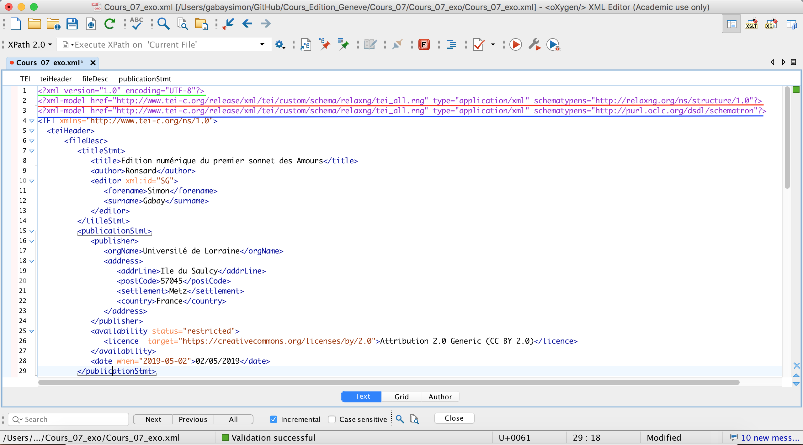
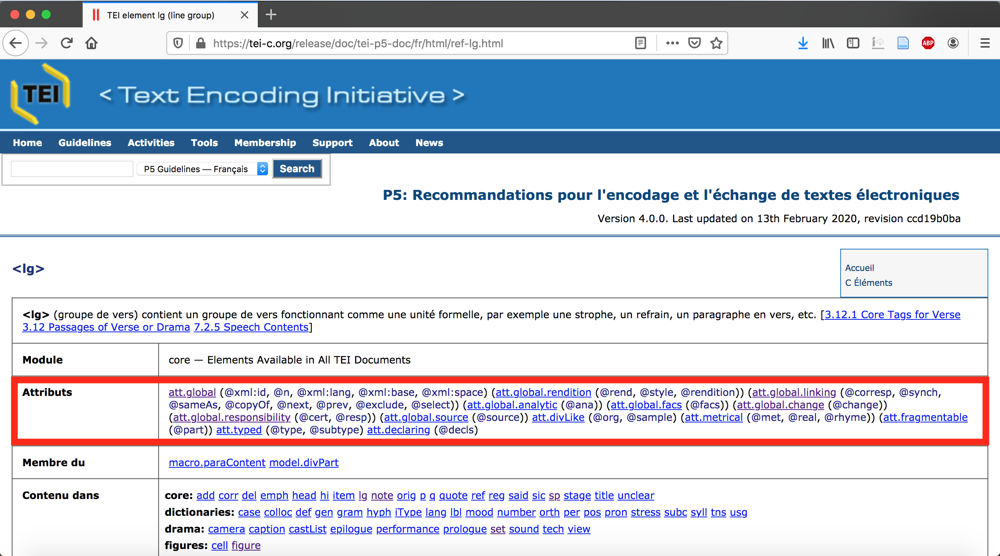

Formation Edition numérique

# L'ODD (_One Document Does it all_)

Simon Gabay


---
# Personnaliser
---

## Ma TEI

La TEI doit (théoriquement) apporter une solution à toutes les situations possibles: l'éventail est donc logiquement trop large pour un projet personnel, même ambitieux. Il faut donc

* Restreindre la TEI à ses besoins en concevant un modèle adapté à ses besoins
* Documenter ce modèle pour expliciter ses choix aux autres, afin de les rendre lisibles et rééxploitables

---
## Des exemples de documentation

Les projets proposent leur documentation

* _Bibliothèques virtuelles humanistes_: http://www.bvh.univ-tours.fr/XML-TEI/index.asp
* Ecole des chartes: http://developpements.enc.sorbonne.fr/diple/schema/
* _ENRICH_: http://projects.oucs.ox.ac.uk/ENRICH/

---
## Typologie des modification
* Suppression d’éléments
* Changement du nom d’éléments
* Modification d’un modèle de contenu
* Modification d’une liste d’attributs ou de valeurs d’attributs, d’un type de contenu
* Modification de l’appartenance à une classe
* Ajout de nouveaux éléments

---
## TEI conformance

Deux règles importantes :
1. Une personnalisation est une restriction de la TEI (elle reste valide contre _TEI All_)
2. Elle ne doit pas altérer le sémantisme des éléments

Si la personnalisation respecte ces deux règles, elle est dite
“propre” (_clean modification_), sinon elle est dite “sale” (_unclean modification_). Une modification sale peut cependant être nécessaire.

---
## Typologie des changements

Changements propres:
* Suppression d’éléments
* Modification d’un modèle de contenu
* Modification d’une liste d’attributs ou de valeurs d’attributs, d’un type de contenu
* Modification de l’appartenance à une classe

Changement sale:
* Changement du nom d’éléments

Changement sale ou propre:
* Ajout de nouveaux éléments (propre si ces nouveaux éléments appartiennent à un autre espace de nom).
* Ajout de nouveaux attributs (pas trop sale s'ils ne sont pas autorisés sur un élément mais existent en TEI)

---
## Solutions simples

Les customisations:
* _All_ : toute la TEI
* _Drama_: pour le théâtre
* _Corpus_: pour l'encodage de corpus linguistique
* _Lite_: version réduite de la TEI
* _Bare_: version minimale de la TEI

La personnalisation
* _oddByExample_
* _Roma_

---
# Un Schema
---

## Construction

Les fichiers TEI commencent par trois informations:
* La déclaration XML (Vert)
* Le lien vers les schema (rouge) et les règles schématron (bleu)



---
## Un nouveau schéma

Notre nouveau schéma est une restriction de la TEI qui reste valide contre _TEI All_. Il existe plusieurs formats:
* XML Schema (`.xsd`) [[cf. wikipedia](https://fr.wikipedia.org/wiki/XML_Schema)]
* RELAX NG XML (`.rng`) [[cf. wikipedia](https://en.wikipedia.org/wiki/RELAX_NG)]
* RELAX NG Compact (`.rnc`)

Le dernier est le plus populaire parmi les utilisateurs de la TEI.

---
## RELAX NG

_Relax NG_ est écrit en XML et est donc à peu près lisible. La règle autorisant cet encodage:

```xml
<lg>
  <l>C'est un trou de verdure où chante une rivière</l>
  <l>Accrochant follement aux herbes des haillons</l>
</lg>
```

est la suivante (dans une version très minimale)

```xml
<element name="lg">
   <oneOrMore>
      <element name="l">
         <text/>
      </element>
   </oneOrMore>
</element>
```
---
## RELAX NG Compact

C'est une version réduite de _RELAX NG_ qui n'est pas écrite en XML. Pour le même texte

```xml
<lg>
  <l>C'est un trou de verdure où chante une rivière</l>
  <l>Accrochant follement aux herbes des haillons</l>
</lg>
```

La règle est désormais la suivante:

```DTD
element book {
    element page { text }+
}
```
Il est très simple de passer de la version compact à la version XML de _RELAX NG_ et inversement.

---
# ODD

---
## Pourquoi l'ODD?

Les règles des schémas sont complexes à écrire et nécessitent une très bonne maîtrise du code. L'ODD sert à contourner ce problème.

* L'_ODD_ est un fichier TEI normal, constitué d'un `<teiHeader>` et d'un `<body>`. Si je maîtrise déjà la TEI, je comprends facilement son fonctionnement.
* L'_ODD_ permet de générer le schéma, mais aussi la documentation du projet en HTML
* L'_ODD_ est accompagné d'une gamme d'outil qui permettent d'effectuer les transformations vers tous les formats nécessaires.

---
## Un double `<body>`

S'il n'y a bien qu'un seul `<body>` dans l'_ODD_, on peut distinguer deux temps:
1. Une série de `<div>` ou j'explique mes choix en rédigeant du texte.
2. Une partie plus technique et plus rigide ou je précise la constitution de mes classes d'attributs (`<specGrp>`) et surtout des modules pour les éléments (`<schemaSpec>`).

```xml
<body>
  <div>
    <p>J'ai fait comme-ci, comme-ça.</p>
  </div>
  <div>
    <specGrp/>
  </div>
   <div>
     <schemaSpec/>
  </div>
</body>
```

---
## Les modules

Concentrons-nous sur `schemaSpec`: il s'agit d'autoriser des éléments: comment les sélectionner? La TEI a en fait regroupés chaque élément dans une module. Tous sont amplement commentés dans les _Guidelines_


---

On retrouve le nom du module dans les _guidelines_ (et, surtout, après quelques années on les connait par cœur).


---
## `moduleRef`

Pour autoriser un élément, je  dois ajouter son module d'abord, puis les éléments du modules que je choisis de conserver (je choisir la logique inverse, et en exclure)

```xml
<schemaSpec ident="monProjet" docLang="fr">
<moduleRef key="textstructure"
           include="TEI text body div front back"/>
<moduleRef key="namesdates"
           include="forename surname orgName persName"/>
</schemaSpec>
```

Certains modules sont obligatoires, comme `core` ou `tei`.

---
## `elementSpec`: les éléments contenus

Je peux ensuite préciser le comportement de mon élément avec `elementSpec`. Je peux préciser les autres éléments qu'il peut contenir

```xml
<elementSpec ident="monElement" mode="change">
  <content>
    <elementRef key="element1"/>
    <elementRef key="element2" minOccurs="1"
   maxOccurs="unbounded"/>
    <sequence>
      <elementRef key="element3"/>
      <elementRef key="element4"/>
    </sequence>
  </content>
</elementSpec>
```
---
## `elementSpec`: les attributs contenus

Je peux ensuite préciser le comportement de mon élément avec `elementSpec`. Je peux préciser les autres éléments qu'il peut contenir

```xml
<elementSpec ident="monElement" mode="change">
  <attList>
    <attDef ident="att1" mode="delete"/>
    <attDef ident="att2" mode="change" usage="req">
      <datatype>
        <dataRef key="teidata.count"/>
      </datatype>
    </attDef>
    <attDef ident="att3" mode="change" usage="req">
      <valList mode="add" type="closed">
        <valItem ident="valeur1"/>
        <valItem ident="valeur2"/>
      </valList>
    </attDef>
  </attList>
</elementSpec>
```

---
## Les classes

En plus des modules, les éléments sont regroupés par classes. Tous les éléments d'une même classe ont (plus ou moins) le même comportement:
* Ils apparaissent au même endroit
* Ont les mêmes attributs
* …

On peut les utiliser pour changer tous les éléments d'une classe d'un coup, notamment pour restreindre la liste d'attributs.

---

On retrouve le nom des classes d'attributs dans les _guidelines_ (et, surtout, après quelques années on les connait par cœur).




---
## `specGrp`

Je vais pouvoir modifier les classes avec `specGrp`

```xml
<specGrp xml:id="classmods">
  <classSpec ident="att.global" mode="change"
             module="tei" type="atts">
    <attList>
      <attDef ident="xml:space" mode="delete"/>
      <attDef ident="xml:base" mode="delete"/>
    </attList>
  </classSpec>
  <classSpec ident="att.divLike" mode="delete"
             module="tei" type="atts"/>
</specGrp>
````
