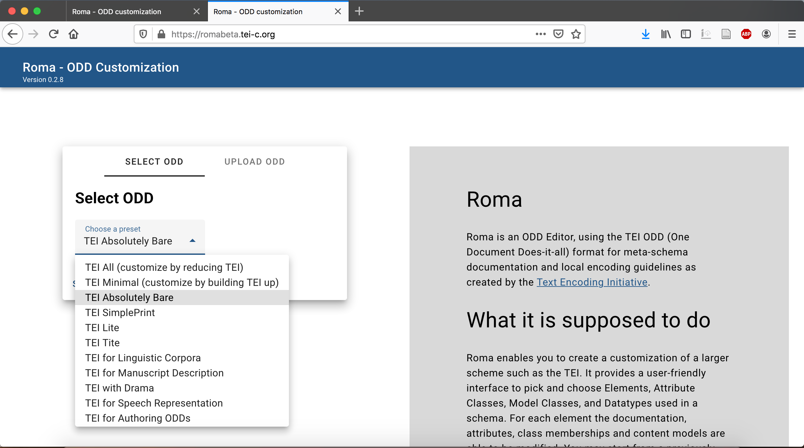
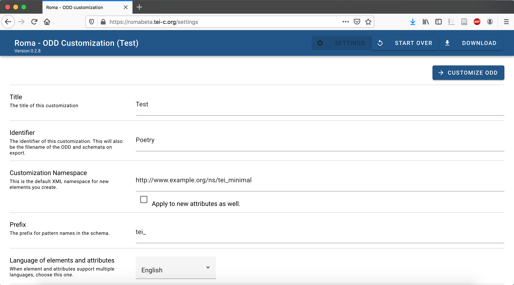
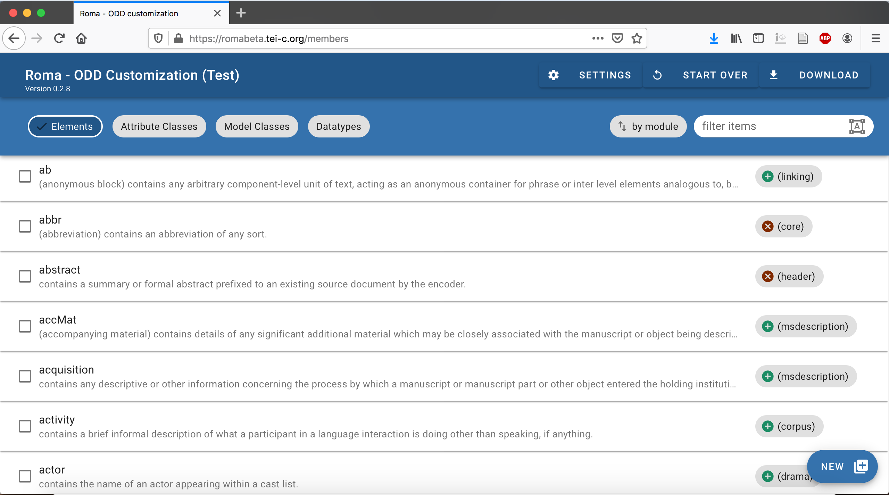
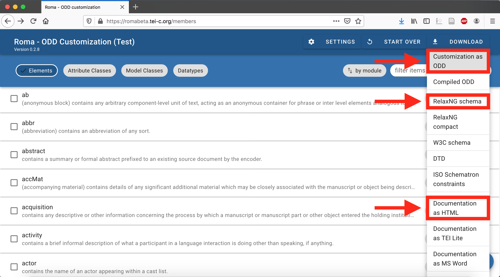
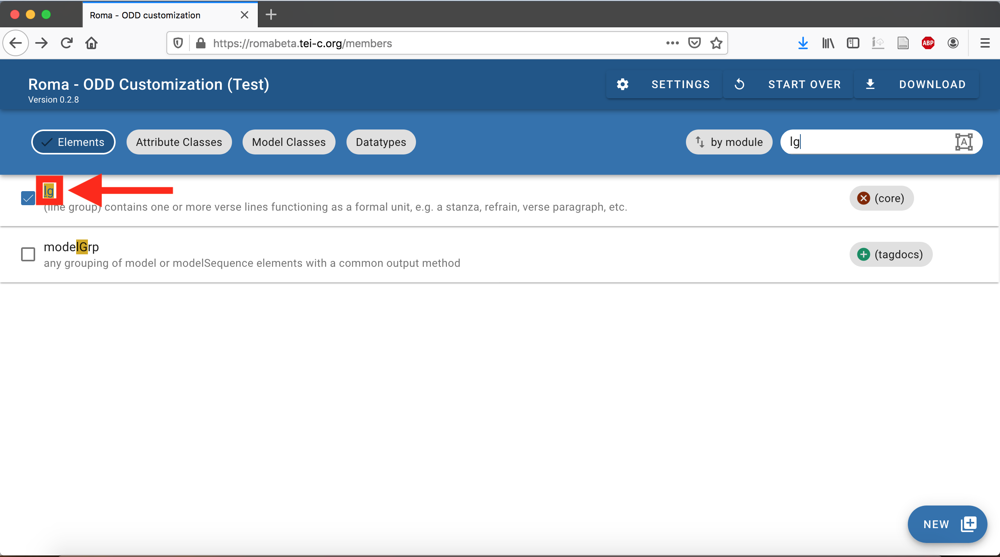
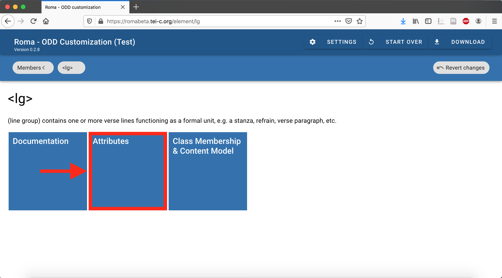

Formation Edition numérique

# L'ODD (_One Document Does it all_)

Simon Gabay

---
# Exercice
---

Nous allons essayer le dernier: https://romabeta.tei-c.org/

---
# Roma
---

Commençons pas sélectionner une customisation. Prenons la plus restreinte, qui contient le strict minimum: `Absolutely Bare`.

---

Remplissons rapidement le formulaire:
* Pour _title_: mettez le nom de votre projet
* Pour _identifier_: ce sera (entre autres le nom du fichier)
* Choisissez votre langue, ajoutez votre nom et cliquez sur `Customize ODD`

---

On tombe sur une interface avec la liste de tous les éléments de la TEI: je dois désormais sélectionner tous ceux qui concernent mon projet.

---

Je peux désormais télécharger:
* ODD
* RelaxNG schema
* Documentatin as HTML

---
Il est possible de préciser, en plus de la liste des éléments disponibles, la liste des attributs autorisés pour chaque élément.

---

---

Il faut sélectionner les attributs

---

Je peux désormais télécharger à nouveau
* ODD
* RelaxNG schema
* Documentatin as HTML

---

Il faut désormais appliquer le nouveau schema. Pour cela il faut remplacer le contenu du `@href` du premier `<?xml-model` (ligne 2, qui finit par `"http://relaxng.org/ns/structure/1.0"`)

1. J'efface `http://www.tei-c.org/release/xml/tei/custom/schema/relaxng/tei_all.rng`
2. J'ajoute le chemin vers mon nouveau schema (le fichier qui finit par `.rng`)
