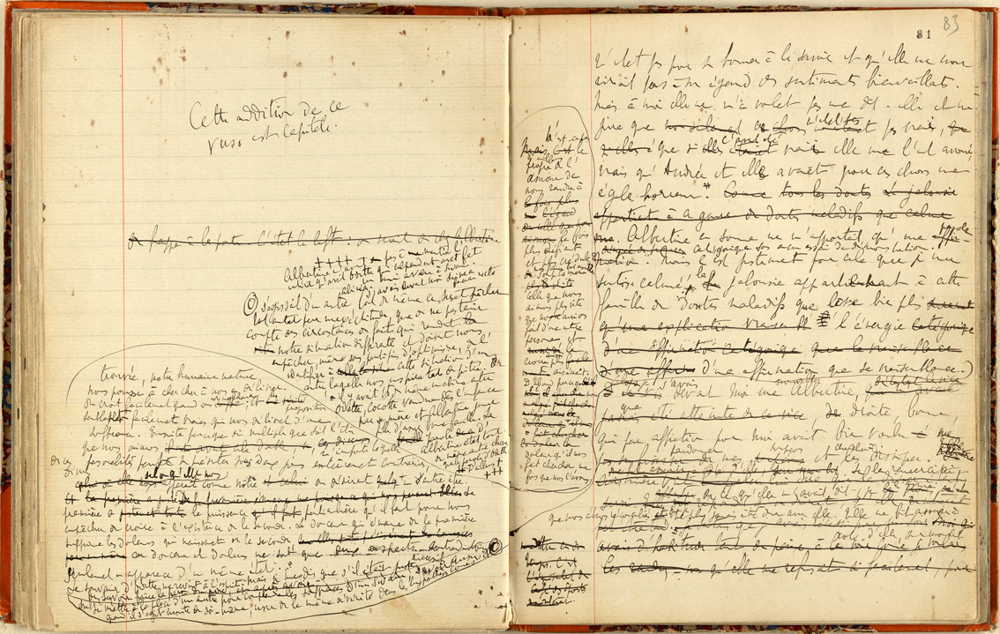

Formation Edition numérique

# L'annotation critique

Simon Gabay


---
# Les variantes

---
## Une entrée
On va utiliser l'élément `<app>`  pour _apparatus entry_.

Chaque `<app>` est constitué de plusieurs leçons `<rdg>` (pour _reading_)

```xml
Hier, je suis allé
<app>
  <rdg>à Genève</rdg>
  <rdg>à Lausanne</rdg>
  <rdg>en Allemagne</rdg>
</app>
avec mon ami
<app>
  <rdg>Ueli</rdg>
  <rdg>Alberto</rdg>
  <rdg>Gaspard</rdg>
</app>
```
---
## Les leçons

Il est possible de signifier que l'on retient une leçon contre les autres, avec `<lem>`  (pour _lemma_)

```xml
Hier, je suis allé
<app>
  <lem>à Genève</lem>
  <rdg>à Lausanne</rdg>
  <rdg>en allemagne</rdg>
</app>
avec mon ami
<app>
  <lem>Ueli</lem>
  <rdg>Alberto</rdg>
  <rdg>Gaspard</rdg>
</app>
```
---

## Les groupes de leçons

Il est possible de regrouper des leçons similaires: simple variation graphique, changement plus profond… Ici les villes vs les pays:

```xml
Hier, je suis allé
<app>
  <rdgGrp type="subvariants">
    <lem>à Genève</lem>
    <rdg>à Lausanne</rdg>
  </rdgGrp>
  <rdgGrp type="subvariants">
    <rdg>en Allemagne</rdg>
  </rdgGrp>
</app>

```
---
# Placer l'apparat critique

---
## le `<body>`, le `<front>`, le `<back>`

Jusqu'à présent nous avons eu une utilisation succincte du `text` en utilisant uniquement la balise `<body>`: en plus du _texte_, il est possible d'avoir un _péritexte_.
* le `<front>` regroupe ce qui précède (introduction, préface…)
* le `<back>` regroupe ce qui succède (postface…)

```xml
<TEI>
  <teiHeader>…</teiHeader>
  <text>
    <front>…</front>
    <body>…</body>
    <back>…</back>
  </text>
</TEI>
```

---
## Modélisation

Il est important de noter que le sémantisme de `<body>`, `<front>` et `<back>` est double:
* Ils peuvent renvoyer au document source: _Andromaque_ est ainsi précédé d'une épître dédicatoire (`<front>`) et du privilège (`<back>`).
* Ils peuvent renvoyer au document édité: le `<front>` contient alors mon introduction linguistique et littéraire, et le `<back>` mes index. L'épître dédicatoire et le privilège deviennent alors de simples `<div>` dans l'œuvre.

Leur emploi dépend donc de mon objectif. Est-ce que je veux produire:
* une reproduction d'un _témoin_ (unique ou pas)
* une édition critique de l'œuvre

---

## Annotation interne vs. annotation externe

Il est possible de laisser la note où elle doit se trouver. On parle d'annotation interne, mais il est possible d'avoir une annotation _externe_, avec une ```<div>``` appropriée dans le `<back>`.

Dès lors que l'apparat critique est externe, il existe deux manières de le relier au lieu de la variation.

* Soit je fais référence au bloc de texte où se trouve la variation (on parle de _Location-referenced Method_ externe)
* Soit je définis précisément le lieu de la variation (on parle de _Double End-Point Attachment_).

---
## _Location-referenced Method_ externe

```xml
<body>
  <lg xml:id="s1">
    <l xml:id="s1v1">Hier, je suis allé à Genève avec mon
      ami…</l>
  </lg>
</body>
<back>
  <div type="apparatus">
    <app loc="s1v1">
     <rdgGrp type="subvariants">
       <lem>à Genève</lem>
       <rdg>à Lausanne</rdg>
     </rdgGrp>
     <rdgGrp type="subvariants">
       <rdg>en Allemagne</rdg>
     </rdgGrp>
    </app>
  </div>
</back>
```

---
## _Double End-Point Attachment_
```xml
<body>
  <p>Hier, je suis allé à <anchor xml:id="lem1s"/>Genève
    <anchor xml:id="lem1e"/> avec mon ami Ueli…</p>
</body>
<back>
  <div type="apparatus">
    <app from="#lem1s" to="#lem1e">
     <rdgGrp type="subvariants">
       <lem>à Genève</lem>
       <rdg>à Lausanne</rdg>
     </rdgGrp>
     <rdgGrp type="subvariants">
       <rdg>en Allemagne</rdg>
     </rdgGrp>
    </app>
  </div>
</back>
```

---
## `variantEncoding`

Si j'utilise la méthode _location-referenced method_ interne je le signale dans le `<encodingDesc>` avec:
```xml
<variantEncoding method="location-referenced"
 location="internal"/>
```

Si j'utilise la méthode _location-referenced method_ externe je le signale dans le `<encodingDesc>` avec:


```xml
<variantEncoding method="location-referenced"
 location="external"/>
```
Si j'utilise la méthode _Double End-Point Attachment_ je le signale dans le `<encodingDesc>` avec:
```xml
<variantEncoding method="double-end-point"
 location="external"/>
```

---
## `witness`

Qui dit plusieurs versions, dit plusieurs témoins d'un même texte: en _TEI_ on parle de `<witness>`. On le décrit notamment à l'aide

* d'un long `<bibl>` car on propose alors une longue description de type bibliographique sur la date, l'auteur, le matériel…
* d'un `<mdDesc>`, avec son `<msIdentifier>`…

Les `<witness>` sont regroupés dans une `<listWit>` placée dans le `<sourceDesc>`.

```xml
<sourceDesc>
  <lisWit>
    <witness xml:id="msA">
      <bibl>…</bibl>
    </witness>
    <witness xml:id="msB">
      <bibl>…</bibl>
    </witness>
  </lisWit>
</sourceDesc>
```

---
# Création et génétique

---

## Processus de création de création vs copie

La philologie étudie traditionnellement les manuscrits qui dérivent d'un _urtext_ (« texte original », vrai ancêtre), mais elle s'intéresse de plus en plus au phénomène inverse: le processus de création du texte. On parle de (philologie) génétique.



---
## Encoder la création

Ces strates de réécriture n'arrivent normalement pas parfaitement alignées: elles sont l'objet de rature, d'ajouts… Il existe pour cela une gamme d'outils simples.

* `del` permet d'encoder un passage effacé
* `add` permet d'encoder un passage ajouté
* `<subst>` permet d'encoder que le passage ajouté remplace le passage effacé.

```xml
Hier je suis allé à <subst><del>Genève</del><add>Lausanne
</add></subst>
````

Dans certains cas l'auteur revient sur son choix, et "annule" l'effacement

```xml
Hier je suis allé à <restore><del>Genève</del></restore>
```

---
## Les attributs

Les attributs ont une grande importance dans la description du processus de création. On peut ainsi préciser que tel passage
* a été ajouté au-dessus de la ligne d'écriture (`<add place="above">`) ou en marge (`<add place="margin">`)
* a été effacé au moyen d'une rayure (`<del rend="strikethrough"`) ou effacé (`<del rend="erased"`)…

---
## Dégager des strates

En TEI, on considère que la variante textuelle entre témoins s'encode de la même manière que le processus de réécriture, au prix d'un léger subterfuge: les témoins `<witness>` sont les strates de réécriture.

Le code est ainsi le même

```xml
Hier, je suis allé
<app>
  <rdg wit="#A">à Genève</rdg>
  <rdg wit="#B">à Lausanne</rdg>
  <rdg wit="#C">en Allemagne</rdg>
</app>
```

Mais `A`, `B` et `C` renvoient dans un cas à des témoins (philologie), dans un autre à des corrections successives (philologie génétique) et donc à des phases d'écriture. Maîtriser une technique, c'est donc maîtriser l'autre (ce qui, philologiquement, fait sens).
