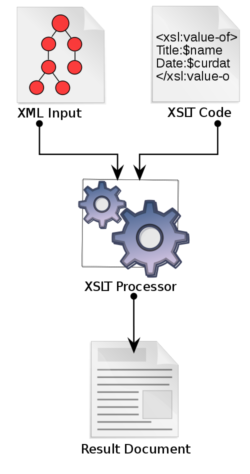
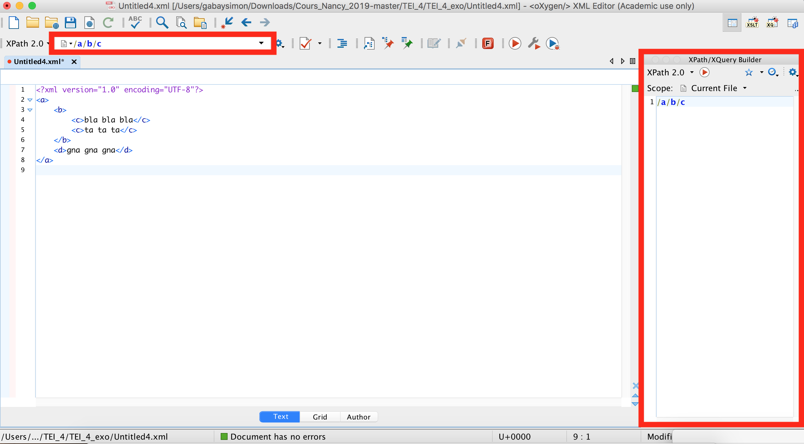

Formation Edition numérique

# La publication web

Simon Gabay


---
## XSLT

---
### XSLT

XSLT (_eXtensible Stylesheet Language Transformations_) est un  langage de transformation XML de type fonctionnel. Il permet de modifier un document XML ou de le transformer en un autre document (CSV, HTML, LaTeX…).

Plus d'informations sur [Wikipedia](https://fr.wikipedia.org/wiki/Extensible_Stylesheet_Language_Transformations)

---
### La transformation



Source: [Wikipedia](https://commons.wikimedia.org/wiki/File:XSLT_en.svg)

---
### Une feuille de style XSLT minimale

```XML
<?xml version="1.0" encoding="UTF-8"?>
<xsl:stylesheet
    xmlns:xsl="http://www.w3.org/1999/XSL/Transform"
    xmlns:xs="http://www.w3.org/2001/XMLSchema"
    exclude-result-prefixes="xs"
    version="2.0">

</xsl:stylesheet>
```

Deux remarques:
1. C'est un langage qui s'écrit en XML (on reconnait les chevrons, les éléments, les attributs…)
2. Il existe plusieurs versions (1, 2 et 3) qui sont légèrement différentes. Il faut donc choisir le bon processeur XSLT (cf. image _supra_ pour la bonne version).

---
### XML et espace de nom

Dans un document XML-TEI, nous avons vu qu'il y a le langage d'une part (XML) et le vocabulaire d'une autre (TEI). Il faudrait donc préciser que les éléments XML utilisés relèvent de cet _espace  de nom_ à chaque fois au moyen d'un préfixe

```XML
<tei:TEI xmlns:tei="http://www.tei-c.org/ns/1.0">
  <tei:teiHeader>
     <tei:fileDesc>
         <tei:titleStmt>
            <tei:title>…
```

Il est possible de faire l'économie de cette précision en déclarant une seule fois l'espace de nom sur l'élément racine:

```XML
<TEI xmlns="http://www.tei-c.org/ns/1.0">
  <teiHeader>
      <fileDesc>
         <titleStmt>
            <title>…
```
---

### XSLT et espace de nom

```XML
<?xml version="1.0" encoding="UTF-8"?>
<xsl:stylesheet
   xmlns:xsl="http://www.w3.org/1999/XSL/Transform"
   xmlns:xs="http://www.w3.org/2001/XMLSchema"
   exclude-result-prefixes="xs"
   version="2.0">

</xsl:stylesheet>
```

Comme sur le document XML, il faut donc préciser l'espace de nom par défaut pour la feuille XSL, car il y en a un autre: ```xsl:```.

```XML
<?xml version="1.0" encoding="UTF-8"?>
<xsl:stylesheet
   xmlns:xsl="http://www.w3.org/1999/XSL/Transform"
   xmlns:xs="http://www.w3.org/2001/XMLSchema"
   exclude-result-prefixes="xs"
   version="2.0"
   xpath-default-namespace="http://www.tei-c.org/ns/1.0">

</xsl:stylesheet>
```
---

### XSLT: principe de base

Une feuille XSLT ne modifie pas un fichier: il retire toutes les balises. Si l'on veut garder ou modifier un élément, il faut ajouter une règle. Pour ce faire, on utilise l'élément ```xsl:template```:

```XML
<xsl:template match="unElement">
  <xsl:apply-templates/>
</xsl:template>
```

Pour "copier-coller" l'élément ```<head>``` de cet exemple

```XML
<head>Sonetz</head>
```

il faut le remettre:

```XML
<xsl:template match="head">
  <head><xsl:apply-templates/></head>
</xsl:template>
```

---

### Une première modification

Pour changer l'élément ```<head>``` en élément ```<h1>```:

```XML
<head>Sonetz</head>
```

il faut appliquer la règle suivante:

```XML
<xsl:template match="head">
  <h1><xsl:apply-templates/></h1>
</xsl:template>
```
On traduit ainsi le document XML en HTML:

```HTML
<h1>Sonetz</h1>
```

---

### Enchaîner les règles

Il faut donc appliquer une règle par élément que l'on veut modifier:

```XML
<xsl:template match="div">
  <div>
    <xsl:apply-templates/>
  </div>
</xsl:template>

<xsl:template match="head">
  <h1>
    <xsl:apply-templates/>
  </h1>
</xsl:template>

<xsl:template match="p">
  <p>
    <xsl:apply-templates/>
  </p>
</xsl:template>
```

---

### Ordre

L'ordre de la feuille de style importe peu: ce qui compte est l'ordre du document XML.

```
<div>
    <head>Titre</head>
    <p>Un paragraphe</p>
    <p>Un autre paragraphe</p>
</div>
````

Ce document XML peut être traité par la série de règles suivante:


```XML
<xsl:template match="p">
  <p><xsl:apply-templates/></p>
</xsl:template>

<xsl:template match="head">
  <h1><xsl:apply-templates/></h1>
</xsl:template>

<xsl:template match="div">
  <div><xsl:apply-templates/></div>
</xsl:template>
```

---

### Une page HTML incomplète

Rappelons qu'une page HTML minimale est la suivante:

```HTML
<!DOCTYPE html>
<html>
    <head>
        <title></title>
    </head>
    <body>mon texte</body>
</html>
```

Notre résultat obtenu ne suffit pas: nous n'avons construit que l'intérieur du ```<body>```:
```
<div>
    <head>Titre</head>
    <p>Un paragraphe</p>
    <p>Un autre paragraphe</p>
</div>
```
---

### Une page HTML complète

Ces informations doivent entourer l'élément racine, que l'on désigne de manière conventionnelle avec un slash (```/```):

```XML
<xsl:template match="/">
  <html>
    <head>
      <title>Exercice XSLT</title>
    </head>
    <body>
      <xsl:apply-templates/>
    </body>
  </html>
</xsl:template>
```

---

### Une transformation XML-TEI -> HTML minimale

Pour modifier un document XML-TEI avec uniquement une ```<div>```:

```XML
<?xml version="1.0" encoding="UTF-8"?>
<xsl:stylesheet
   xmlns:xsl="http://www.w3.org/1999/XSL/Transform"
   xmlns:xs="http://www.w3.org/2001/XMLSchema"
   exclude-result-prefixes="xs" version="2.0"
   xpath-default-namespace="http://www.tei-c.org/ns/1.0">

  <xsl:template match="/">
    <html>
      <head>
        <title>Exercice XSLT</title>
      </head>
      <body><xsl:apply-templates/></body>
    </html>
  </xsl:template>

  <xsl:template match="div">
    <div><xsl:apply-templates/></div>
  </xsl:template>

</xsl:stylesheet>
```

---
## XPath

---

### Précision

Dans la règle que nous avons mentionné au tout début, il convient de corriger une approximation

```XML
<xsl:template match="unElement">
  <xsl:apply-templates/>
</xsl:template>
```

Dans cet exemple ```unElement``` n'est pas exactement le nom d'un élément, mais une fonction XPath.

---

### XPath

XPath est un langage de requête pour localiser une portion d'un document XML.

Plus d'informations sur [Wikipedia](https://fr.wikipedia.org/wiki/XPath)

---

### Principe de base

Dans le document suivant, chaque élément, chaque élément est accessible par un chemin (en anglais _path_, d'où _XPath_):

```XML
<a>
  <b>
    <c>bla bla bla</c>
    <c>ta ta ta</c>
  </b>
  <d>gna gna gna</d>
</a>
```
Pour ```<d>```, le chemin est le suivant:

```console
/a/d
```

Pour les deux ```<c>```, le chemin est le suivant:

```console
/a/b/c
```

On reconnait le ```/``` que nous avions vu précédemment

---

### Dans Oxygen

On peut faire des requêtes XPath à deux endroits dans Oxygen:



---

### Principes avancés: ```//```

Il est possible de faire un raccourci:

```console
/a/b/c
```

Peut s'écrire:

```console
//c
```

Attention cependant: dans ce cas on récupère tous les éléments ```<c>```. Le résultat de nos deux requêtes XPath est donc différent pour le document XML suivant:

```XML
<a>
  <b>
    <c>bla bla bla</c>
    <c>ta ta ta</c>
  </b>
  <c>gna gna gna</c>
</a>
```

---

### Principes avancés: les prédicats

Il est possible de préciser notre chemin avec des prédicats. Prenons le document suivant:

```XML
<a>
  <b>
    <c type="bla">bla bla bla</c>
    <c type="ta">ta ta ta</c>
  </b>
  <c>gna gna gna</c>
</a>
```

Il est possible de dire que l'on veut le premier ```<c>``` uniquement:

```console
/a/b/c[1]
```

Ou que l'on veut un élément avec un attribut précis (attention aux guillemets simples:

```console
/a/b/c[type='bla']
```

---

### La famille xml

On décrit souvent le XML sur un mode généalogique (on parle "d'axe"):

```XML
<a>
  <b>
    <c type="bla">bla bla bla</c>
    <c type="ta">ta ta ta</c>
  </b>
  <c>gna gna gna</c>
</a>
```

Dans ce cas:

1. ```<b>``` est le parent (_parent_) de ```<c>```
2. ```<b>``` est l'enfant (_child_) de ```<a>```
3. ```<c>``` est le descendant (_descendant_) de ```<a>```
4. ```<a>``` est l'ancêtre (_ancestor_) de ```<c>```

---

### Principes avancés: les axes

Il est possible d'utiliser ces informations généalogiques pour localiser des éléments précis:

```XML
<a>
  <b>
    <c>bla bla bla</c>
    <c>ta ta ta</c>
  </b>
  <c>gna gna gna</c>
</a>
```

```console
//c[parent::a]
```

est l'équivalent de

```console
/a/c
```

On peut combiner les prédicats:

```console
//c[parent::b][1]
```
