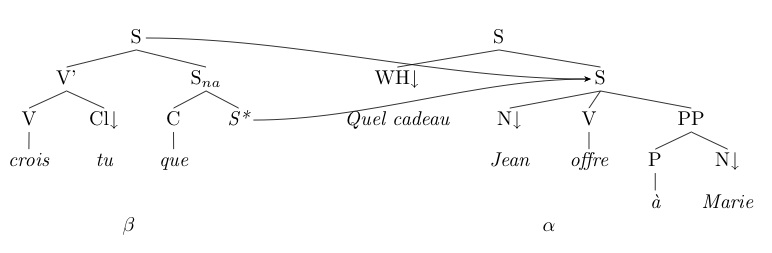
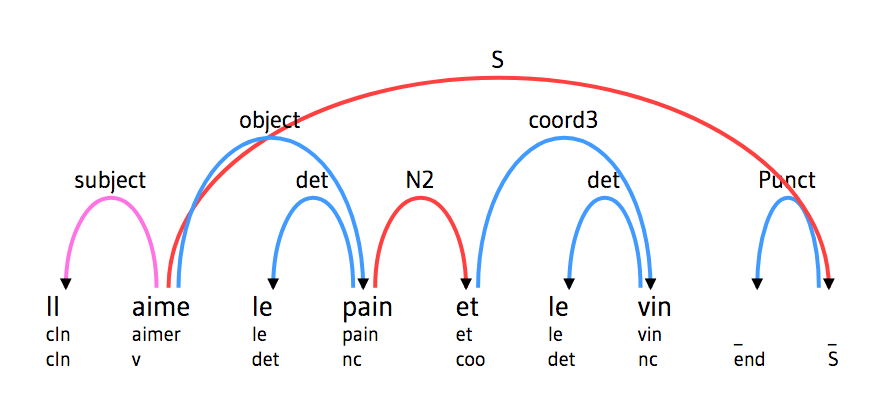
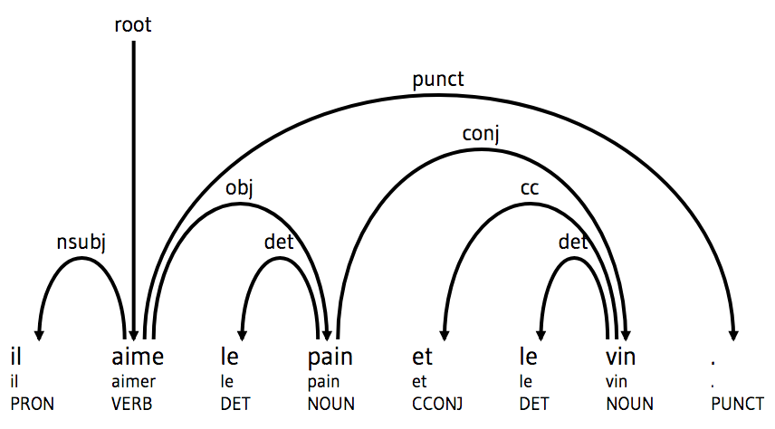
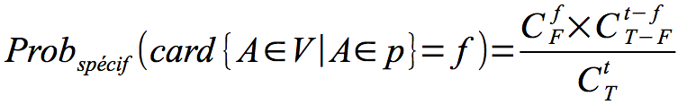
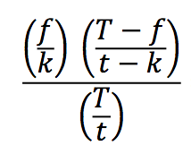
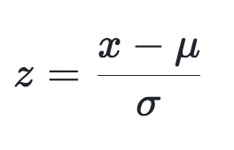

Formation Edition numérique

# Exploration textométrique

Simon Gabay

---
# Du corpus

---
## Le matériau

Comme toute les sciences, la stylistique s'appuie sur des preuves, qu'il s'agit de collecter, puis d'analyser. Ces preuves sont de divers ordres:

1. Énonciation
2. Textualité
3. Syntaxe
4. Rythme et sonorités
5. Lexique
6. Figures

---
## L'intuition computationnelle

1. L'informatique peut-elle nous aider à accélérer ces relevés?
2. L'informatique peut-elle nous aider à relever autre choses?

Les approches computationnelle de la langue, mais aussi de la linguistique, font le pari que oui.

---
## Le corpus

Una approche computationnelle est quantitative, et donc fondée sur des fréquences, mais aussi des différences de fréquence. Celles-ci sont calculées sur des textes, et le choix de ces textes détermine la fiabilité des résultats.

>Une approche quantitative requiert une fondation solide de la base de données et dans l'analyse et la catégorisation des données.
>
>_A quantitative perspective requires a very solid foundation in the preparation of the data base and in the analysis and categorisation of the data._

Jucker, "Corpus pragmatics", 2018

---
## Typologie

On va donc avoir recours à un corpus. Aarts (2011) en propose une typologie simple:
* _Balanced corpora_: on fournit une image plus ou moins représentative d'une langue, d'état de langue, d'un champ…
* _Full-text corpora_: on fournit des textes complets
* _Parallel corpora_: on fournit des textes en plusieurs langues, ou de plusieurs versions d'une même langue (par exemple des dialectes)

Il existe évidemment une tension entre:
* Peu de données richement contextualisées
* Des corpus de grande taille, mais avec peu d'information supplémentaire

---
## Balancement

Aarts propose en 2011 la notion de _balanced corpus_, mais la création de tels corpus a commencé dans les années 60:
* Le _London-Lund Corpus of Spoken English_ (LLC)
* Le _Brown Corpus_ de l'anglais américain écrit
* Le _Lancaster-Oslo-Bergen_ (LOB) de l'anglais britannique écrit.

Nous avons aussi désormais des corpus diachroniquement balancés:
* Le _Early Modern English Medical Texts_ (EMEMT)

---
## Représentativité

>Un corpus est pensé comme représentatif de la variété de langue qu'il est supposé représenté si les découvertes basées sur son contenu peuvent être généralisées à ladite variété de langue.
>
>_A corpus is thought to be representative of the language variety it is supposed to represent if the findings based on its contents can be generalized to the said language variety._

Leech, "The State of the Art in Corpus Linguistics", 1991

---
## Représentativité (II)

Mais la représentativité est un concept fluide, très lié au questions de recherche:
* Faut-il un corpus général?
* Faut-il un corpus spécialisé? Si oui comment?

**Toute prétention à la représentativité et au balancement doit être interprétée en termes relatifs**

---
## Linguistique de corpus vs textométrie

>La textométrie ne se confond pas avec la linguistique de corpus. Toutes deux fondent leurs investigations sur un corpus numérique, dont la constitution est déterminante. Comme son nom l'indique, la linguistique de corpus poursuit un objectif de description et de modélisation de la langue. La textométrie, centrée sur le texte, a pu être mobilisée par diverses sciences humaines (histoire, littérature, sciences politiques...).
>\[La textométrie] se caractérise notamment par certains calculs fondateurs, statistiques (les spécificités, les cooccurrences) ou non (les segments répétés, les concordances), et accorde une place fondamentale au « retour au texte » (bien outillé dans les logiciels) pour interpréter les unités (généralement des mots) sélectionnées par les calculs.
Pincemin, "Sémantique interprétative et textométrie", 2012.

---
### Textométrie vs stylométrie

>La lexicométrie s’est d’abord définie comme étude du vocabulaire, avant qu’on ne parle de logométrie – comme étude globale d’un discours – ou encore de textométrie, comme analyse d’un texte. Le terme de stylométrie, quant à lui, fonde sa spécificité dans la caractérisation d’une écriture.

Magri-Mourgues, "Stylistique et statistiques. Le corpus textuel et hyperbase", 2016,

---
# Les outils

---
## Plus que le mot

Evidemment, ces recherches s'appuient sur le texte numérisé, et donc les mots qui le constitue. En plus de la recherche plein texte, nous pouvons désormais compter sur des outils qui ajoutent un surcroît d'information, et permettent des recherche jusqu'à présent inédites.

Ces informations ne sont cependant pas simples à ajouter, car elles dépendent de choix complexes qui ont un impact très fort sur les résultats lors de la fouille de texte.

---
## Le token

Le token (en français "jeton") n'est pas un mot, c'est une entité lexicale. C'est une chaîne de caractères (_string_) entre deux délimiteurs. Ces délimiteurs sont eux-mêmes une chaîne de caractères (usuellement virgule, point-virgule… éventuellement précédés d'un espace insécable), dont le choix est (relativement libre).

Prenons l'exemple de "aujourd'hui". Nous avons un mot qui est composé de:
1. un token: _aujourd'hui_
2. deux tokens: _aujourd'_ et _hui_
3. trois tokens: _aujourd_, _'_ et _hui_

---
## Le lemmatiseur

* Faire passer de la forme fléchie à son lemme.
* Ce lemme est une forme canonique. Dire qu'elle n'est pas fléchie est problématique: le masculin n'est-il pas aussi fléchi? (cf. notion de flexion zéro)
* Il faut faire la différence entre le lemme et le mot vedette de l'entrée du dictionnaire
* Il faut s'appuyer sur un référentiel, comme _Morphalou_, car il faut éviter qu'un même mot ait deux lemmes (_œil_, _clef_ …)

---

| token |
|-------|
| Je    |
| mange |
| une   |
| pomme |

---

| token | Lemme  |
|-------|--------|
| Je    | je     |
| mange | manger |
| une   | un     |
| pomme | pomme  |

---
## Le POS tagger

On parle de _POS_ pour _part of speech_, "partie du discours". Un _POS tagger_ permet donc d'accoler à chaque token sa nature grammaticale.

Pour cela on utilise un jeu d'étiquettes précis: `N` pour le substantif, `Aj`pour l'adjectif, `D` pour le déterminant… Il en existe plusieurs, et il faut choisir, ce qui n'est pas facile.

Il existe des cas limites, comme l'adjectivation (du participe passé, du participe présent…): comment trancher entre étiquetage morphologique et morpho-syntactique?

En plus de la nature, on peut rajouter des informations supplémentaires: le nombre, le genre, le mode, le temps, la personne…

---

| token | Lemme  |
|-------|--------|
| Je    | je     |
| mange | manger |
| une   | un     |
| pomme | pomme  |

---

| token | Lemme  | CATTEX | UDpos | EAGLES   | MULTEX |
|-------|--------|--------|-------|----------|--------|
| Je    | je     | PROper | PRON  | PRON_PER | Pp     |
| mange | manger | VERcjg | VERB  | V_GVRB   | Vv     |
| une   | un     | DERndf | DET   | ART      | Dn     |
| pomme | pomme  | NOMcom | NOUN  | NN       | Nc     |

---
.

| Token  |
|--------|
|de      |
|ce      |
|trait   |
|perçant |
|mon     |
|coeur   |
|est     |
|blessé  |
| .      |
|C'      |
|est     |
|moi     |

---
.

| Token  | Lemme   | POS    | Morphologie                           |
|--------|---------|--------|---------------------------------------|
|de      | de      | PRE    | MORPH=empty                           |
|ce      | ce      | DETdem | NOMB.=s\|GENRE=m                      |
|trait   | trait   | NOMcom | NOMB.=s\|GENRE=m                      |
|perçant | percer  | VERppa | NOMB.=s\|GENRE=m                      |
|mon     | mon     | DETpos | PERS.=1\|NOMB.=s\|GENRE=m             |
|coeur   | cœur    | NOMcom | NOMB.=s\|GENRE=m                      |
|est     | être    | VERcjg | MODE=ind\|TEMPS=pst\|PERS.=3\|NOMB.=s |
|blessé  | blesser | VERppe | NOMB.=s\|GENRE=m                      |
| .      | .       | PONfrt |                                       |
|C'      | ce      | PROdem | NOMB.=s\|GENRE=n                      |
|est     | être    | VERcjg | MODE=ind\|TEMPS=pst\|PERS.=3\|NOMB.=s |
|moi     | je      | PROper | PERS.=1\|NOMB.=s\|GENRE=x\|CAS=i      |

---

## Le parseur

Le parseur permet de faire de l'analyse syntaxique – en anglais on parle de _syntactic parsing_. Il s'agit désormais, en plus du lemme et de la POS de récupérer la fonction dans la phrase.

Cette approche s'appuie beaucoup sur la grammaire d'arbres adjoints (TAG, _Tree-adjoining grammar_ ) qui représente la phrase sous la forme de graph.

Source: [Wikipedia](https://commons.wikimedia.org/wiki/File:Recursion-tag-fr.jpg?uselang=fr)

---

Exemple

> Il aime le pain et le vin.

---
Comment analyser la coordination?

> Il aime le pain et le vin .

> Il aime le pain et le vin .

> Il aime le pain et le vin .

---
DeepXML

---
UD

---
CoNLL

|   | token | Lemme | POS 1 | POS 2 | Morph | Rel. | Fonction  |
|---|-------|-------|-------|-------|-------|------|-----------|
| 1 | Il    | il    | CL    | CLS   | s=suj | 2    | suj       |
| 2 | aime  | aimer | V     | V     | t=pst | 0    | root      |
| 3 | le    | le    | D     | DET   | s=def | 4    | det       |
| 4 | pain  | pain  | N     | NC    | s=c   | 2    | obj       |
| 5 | et    | et    | C     | CC    | s=c   | 4    | coord     |
| 6 | le    | le    | D     | DET   | s=def | 7    | det       |
| 7 | vin   | vin   | N     | NC    | s=c   | 5    | dep_coord |
| 8 | .     | .     | PONCT | PONCT | _     | 2    | ponct     |

---
## Les autres taggeurs

On parle de plus en plus d' _Inside–outside–beginning_ (IOB) format pour les entités nommées.

Une entité nommée est une expression linguistique référentielle. Elle renvoie la plupart du temps à une personne ou un lieu.

Exemple:

> Livia Jeanneret va à Los Angeles

---

| Token     | Entité |
|-----------|--------|
| Livia     |        |
| Jeanneret |        |
| va        |        |
| à         |        |
| Los       |        |
| Angeles   |        |

---

| Token     | Entité |
|-----------|--------|
| Livia     | PER-B  |
| Jeanneret | PER-I  |
| va        | 0      |
| à         | 0      |
| Los       | LOC-B  |
| Angeles   | LOC-I  |

---
# Méthode

---
## Spécificité

1. Décompte des occurrences
2. Diviser cette fréquence par le nombre total d’occurrences se trouvant dans la partie considérée
3. Recourir à l'indice de spécificité de Lafon, qui (pour faire très vite) "recontextualise" une fréquence dans un sous-corpus par la fréquence dans le corpus.

Un calcul statistique de spécificités mobilise fortement les contextualisations globales mais ignore les relations de succession immédiate des mots.

Lafon, "Sur la variabilité de la fréquence des formes dans un corpus", 1980

---

Le calcul de la probabilité qu’une forme _A_ apparaisse _f_ fois dans une partie _p_ de longueur _t_, la forme apparaissant _F_ fois en tout dans l’ensemble du corpus dont la longueur totale est de _T_ occurrences, peut s’exprimer formellement par l’équation:

cf. [Manuel de TXM](http://textometrie.ens-lyon.fr/html/doc/manual/0.7.9/fr/manual43.xhtml#seqrefIllustration63).

---
## Cooccurrence
On peut définir trois types de contextes:

* Immédiate (par exemple la phrase)
* Proche (par exemple le paragraphe)
* Large (par exemple le chapitre)

Des mots reliés partagent non seulement ce contexte, mais un écart-réduit positif ou une  probabilité forte selon la loi hypergéométrique.

>Ce que produit le calcul textométrique, ce sont donc des cooccurrents, au plan des signifiants ; et ce qui est visé, c'est l'obtention de corrélats, au plan des signifiés.

Pincemin, "Sémantique interprétative et textométrie", 2012

---

## Hypergéométrie

La loi hypergéométrique revient à calculer une probabilité en fonction de toutes les combinaisons possibles dans un ensemble fini et sans remplacement (cf. tirage au sort).

Privilégiée pour le petit corpus ou les mots peu fréquents.

La formule d’ensemble s’écrit ainsi avec les paramètres T (étendue du corpus), t (étendue du sous-corpus), f (fréquence du mot dans le corpus), k (fréquence du même mot dans le sous-corpus)

Brunet, "Loi hypergéométrique et loi normale. Comparaison dans les grands corpus", 1980.

---
## Ecart réduit (en anglais _standard score_ ou _z score_)

Un écart-réduit mesure de combien d'écarts-types (σ) une observation particulière (x) est éloignée de la moyenne de la population (μ).

L'écart-type sert à mesurer la dispersion, ou l'étalement, d'un ensemble de valeurs autour de leur moyenne. Plus l'écart-type est faible, plus la population est homogène.

Source: [Wikipedia](https://fr.wikipedia.org/wiki/%C3%89cart_type#/media/Fichier:Standard_deviation_diagram.svg)

---

* Un écart-réduit positif signifie que l'observation est supérieure à la moyenne.
* Un écart-réduit négatif signifie que l'observation est inférieure à la moyenne.
* Un écart-réduit proche de 0 signifie que l'observation est proche de la moyenne.
* Une observation est considérée comme atypique si son écart-réduit est supérieur à 3 ou inférieur à −3

On sélectionne alors une liste de cooccurrents significatifs en convenant d'un seuil sur la valeur absolue de l'écart-réduit.

Cf. l'analyse de _dix_ par Rastier 1989 dans la nouvelle _Toine_ de Maupassant.

---
# Ce que l'on cherche
---
## Alexandre von Humboldt

_Innere Sprachform_: « forme intérieure du langage »

>Il s’agit d’un noyau de la langue plus fondamental que le système des formes frappées dans le son. C’est là distinguer l’âme de la langue de l’organisme linguistique, en quelque sorte déjà fait.

Dilberman, " Wilhelm Von Humboldt et l'invention de la forme de la langue", 2006

---
## Dépassement d'Alexandre von Humboldt?

>Enfin, l’opposition humboldtienne entre la forme intérieure et la forme extérieure des textes, qui a fait couler tant d’encre chez les stylisticiens, pourrait recevoir une nouvelle formulation qui la relativise : la forme intérieure, loin d’être un mystère esthétique, est constituée par les régularités jusqu’à présent imperceptibles de la forme extérieure, celle de l’expression, que les moyens théoriques et techniques de la linguistique de corpus permettent à présent de mettre en évidence. En d’autres termes, le contenu d’un texte ne se réduit certes pas à une mystérieuse représentation mentale : un texte est fait de deux plans, celui des formes sémantiques et celui des formes expressives, dont le genre notamment norme la mise en corrélation. Au sein de chaque plan s’établissent des relations forme / fond, de type gestaltiste, qui permettent la perception sémantique et phonologique.

Rastier 2005

---
## Au delà du lexique

Un calcul basé sur des mots peut ainsi conduire à

* repérer des sèmes (infralexicaux, chaque mot portant potentiellement plusieurs sèmes)
* construire des molécules sémiques qui renvoient à un thème (supra-lexical, à la manifestation diffuse, qui se prête à des lexicalisations multiples).

Derrière le simple niveau lexical se cache quelque chose de plus profond, que l'on atteint par le biais du lexique.
