Formation Edition numérique

# Exploration textométrique

Simon Gabay


---
# Premier corpus

---
## Corpus en XML

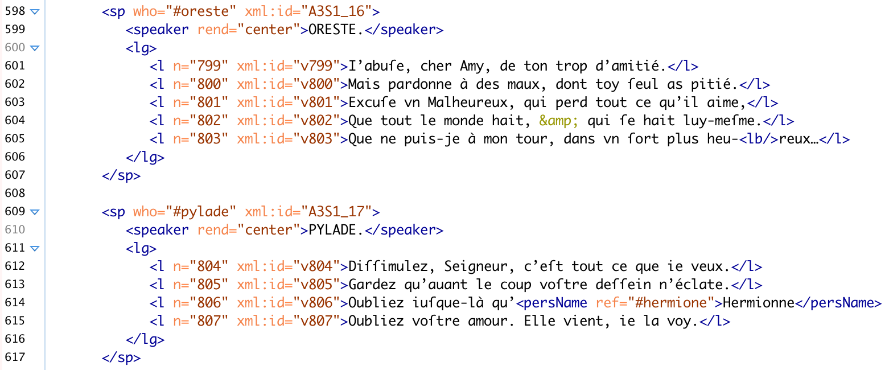

---
## Import XML

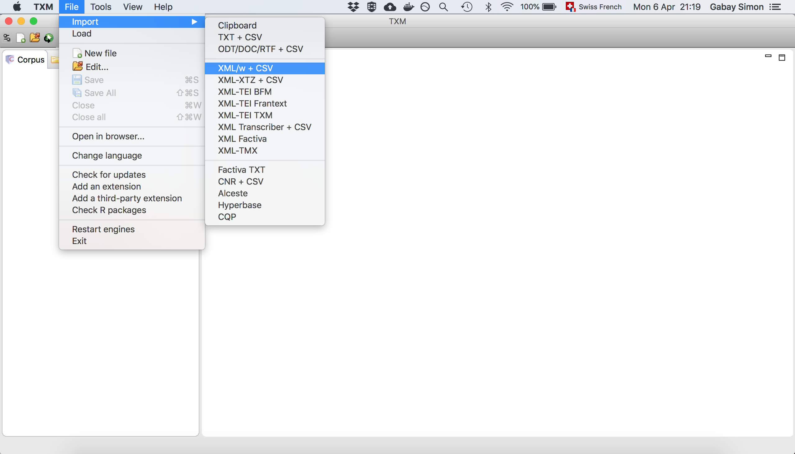

---
## Paramètres


Effectuer les trois étapes:
1. Sélectionner le dossier `CORPUS1`
2. Paramétrer l'import (pour l'instant nous ne faisons rien)
3. Importer

---
## Chargement

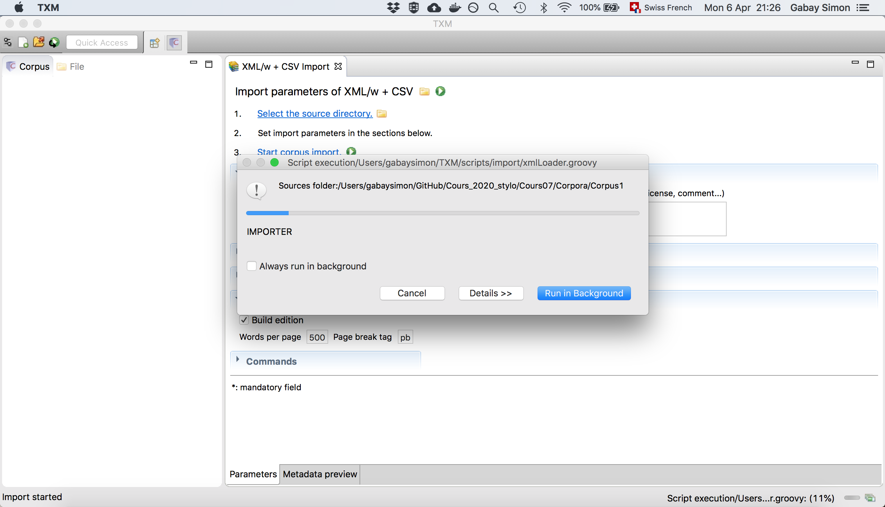

---
## Chargé!

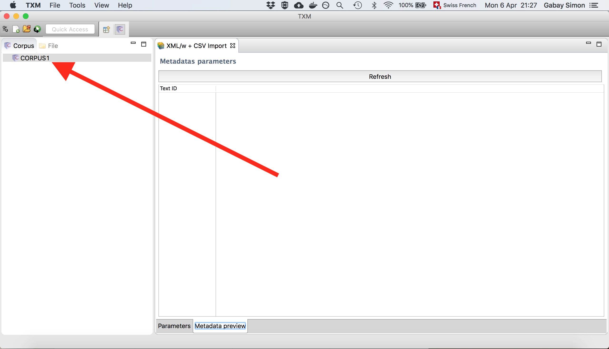

---
## Options

Observez (clic droit sur le nom du corpus dans la colonne de gauche)
* `Dimensions`
* `Edition`
* `Lexicon`
* `Index`

---
## Options

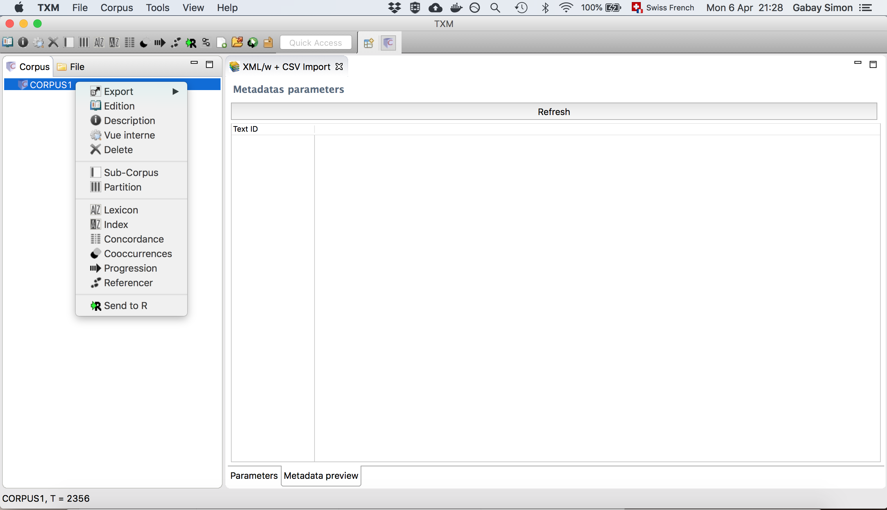

---
## Un mot

* Dans l'index, cherchez _seigneur_
* Affichez la concordance (clic droit)
* Affichez l'occurrence dans l'édition (clic droit sur l'occurence)

Revenez à l'index
* Affichez la cooccurrence (clic droit)

Revenez à l'index

* Affichez la progression (clic droit)

---
## Vers la concordance

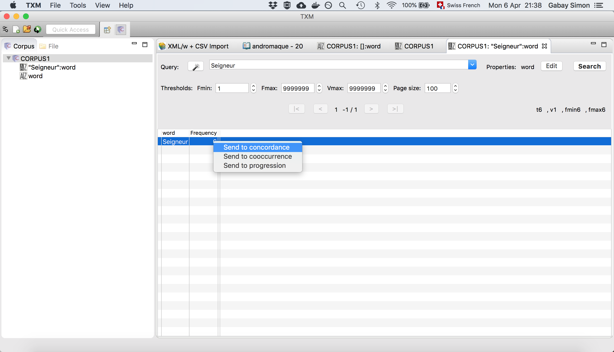

---
## Vers l'édition

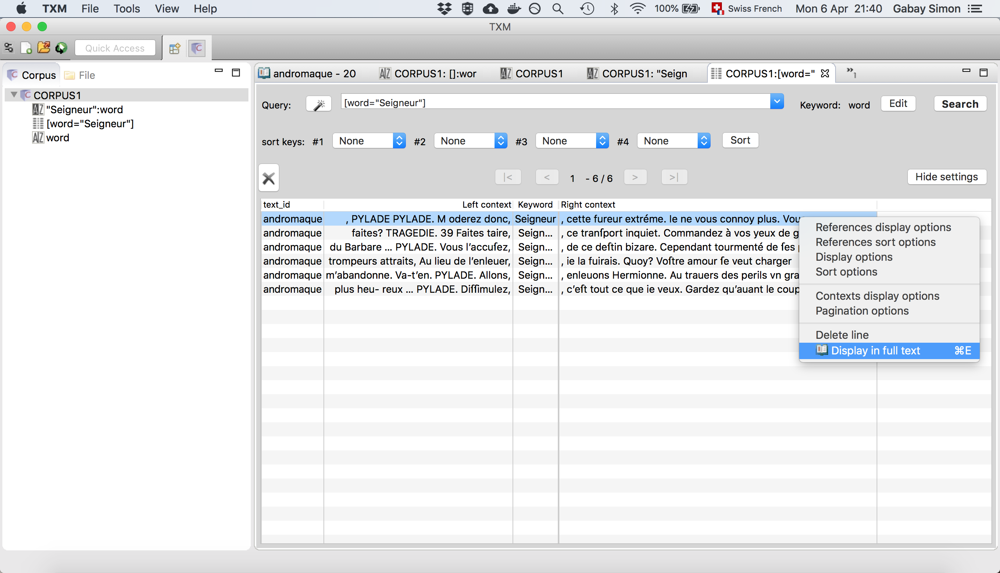

---
## Partitionner le corpus

Nous allons créer des partitions dans notre corpus.

Rappelons que notre fichier original est en XML-TEI, soit un langage (XML) et un vocabulaire (TEI) qui servent de standard dans les humanités numériques. Si l'on est formé en XML-TEI, on sait que, dans les pièces de théâtre, les prises de paroles sont balisées avec l'élément `<sp>` et le nom de la personne qui prend la parole est indiqué sous une forme codifiée avec l'attribut `@who`.

```XML
<sp who="#codeNom">
  <speaker>NOM</speaker>
  <l n="versNumero1">un vers</l>
  <l n="versNumero2">un autre vers</l>
  <l n="versNumero3">encore un autre vers</l>
</sp>
```
---
## Corpus en XML


---
## Créer une partition


---
## Créer une partition

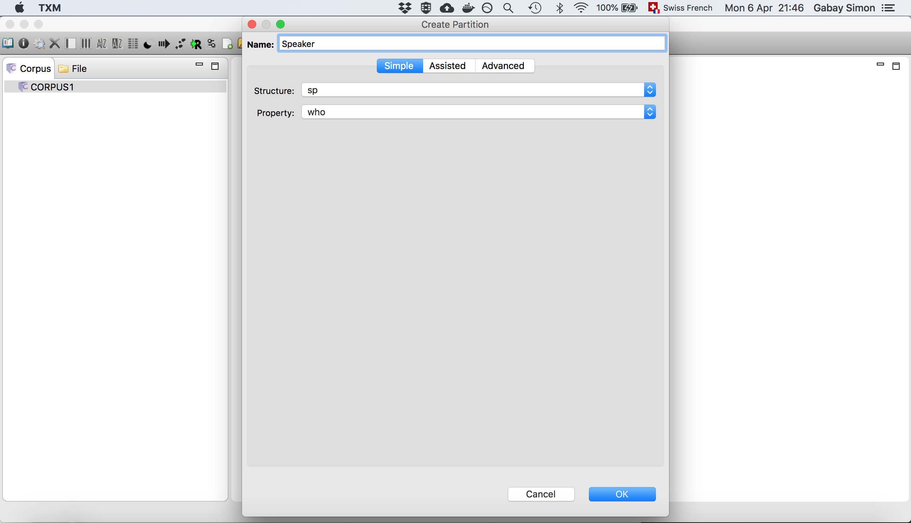

---
## Explorer la partition

* Créer une table lexicale
* Explorer la partition
* Supprimer la ponctuation
* Calculer les spécificités d'Oreste et de Pylade

---
## Créer une table

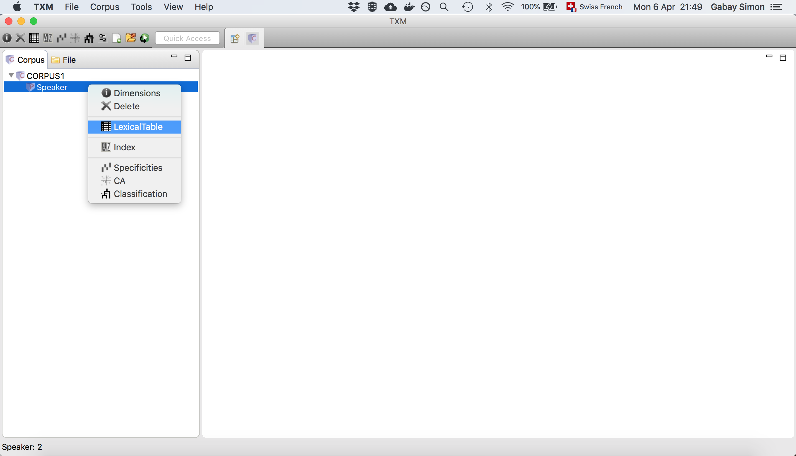

---
## Supprimer des rangs

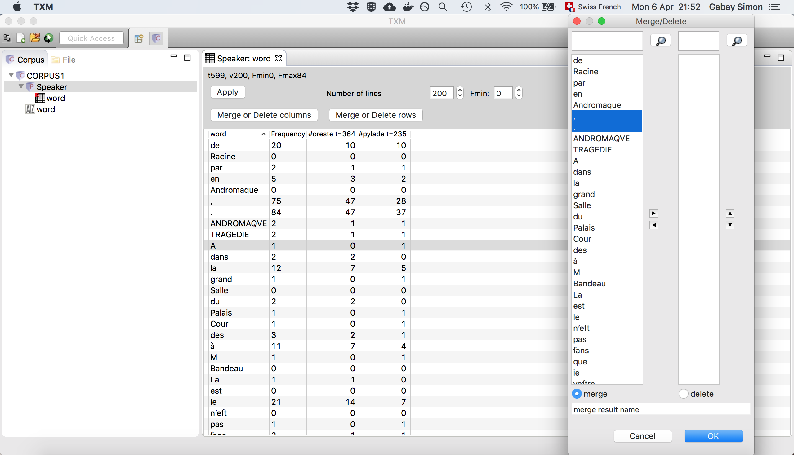

---
## Supprimer des rangs


---
## Calculer les spécificités

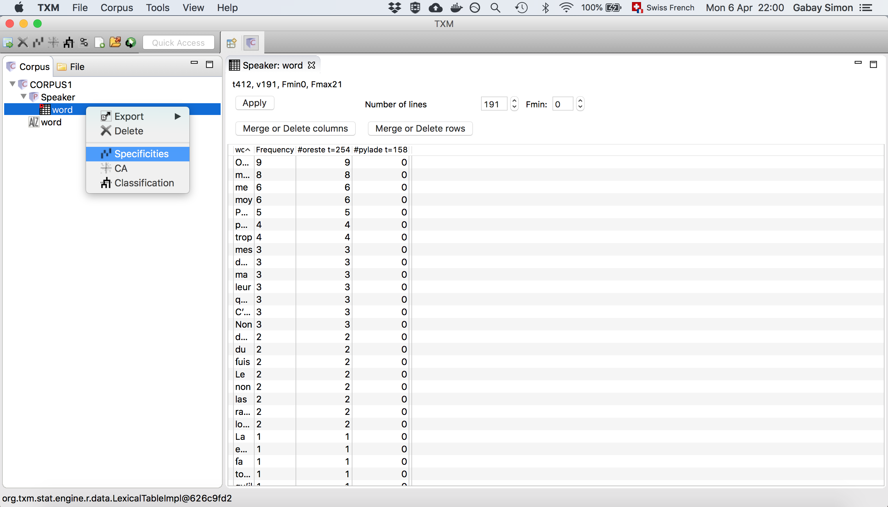

---
## Générer un histogramme

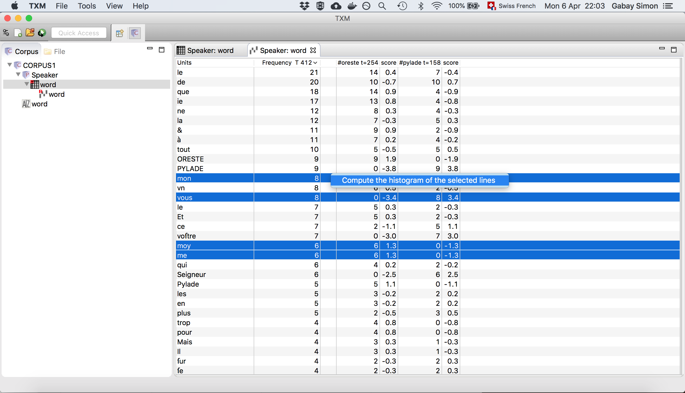

---
# Second corpus

---
## Description succincte

* **Groupe 1** (c. 1630-1650)
	* Pierre Du Ryer (fl. 1628-1655)
	* Georges de Scudéry (fl. 1631-1643)
	* Jean de Rotrou (fl. 1635-1649)
	* Paul Scarron (fl. 1648-1660)
* **Groupe 2**
	* Pierre Corneille (fl. 1629-1675)
* **Groupe 3** (c. 1650-1690)
	* Claude Boyer (fl. 1646-1697)
	* Thomas Corneille (fl. 1651-1696)
	* Molière (fl. 1655-1673)
	* Jean Racine (fl. 1664-1691)

On trouve des comédies, des tragédies, des tragi-comédies

---
## Metadonnées

Les informations sur les textes, les _métadonnées_, sont importantes: il convient de les garder pour l'étude du corpus. Cette fois, nous allons donc les importer avec les textes. Pour cela il faut:
* Ajouter un fichier csv
* La première colonne, intitulée `id`, contient le nom du fichier (sans extension)
* Le contenu et le titre des autres colonnes sont libres: on met ce qu'on veut, comme le genre, la date…

---
## Metadonnées

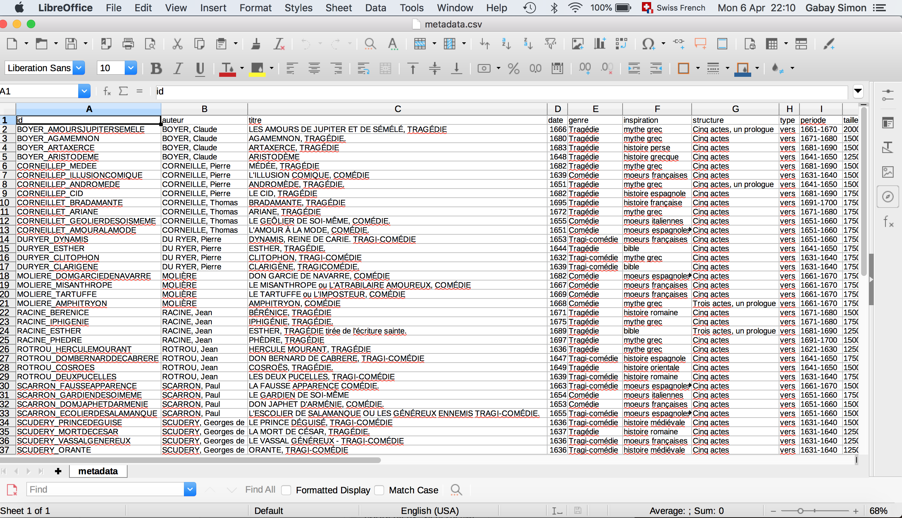

---
## Import XML

Recommençons l'import XML
* Activez la lemmatisation
* Regardez un peu les autres options au passage, comme la tokenisation
* (En cas de souci: `Load>CORPORA/TXM`)
* Allez directement à l'index

---
## Lemmatisation

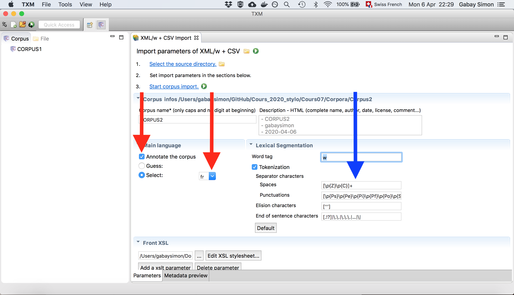

---
## Exploration

Nous allons utiliser CQP (_Corpus Query Processor_): c'est un moteur de recherche puissant dans un corpus textuel

Pour utiliser CQP, il faut un langage: CQL (_Corpus Query Language_)
> Une expression (ou équation) CQL est une chaîne de caractères exprimant un motif linguistique (un mot, ou une suite de mots) à partir des valeurs de leurs propriétés (comme la catégorie grammaticale, le lemme, la forme graphique).

Manuel de TXM [en ligne](http://textometrie.ens-lyon.fr/html/doc/manual/0.7.9/fr/manual60.xhtml)

On avait déjà fait une première requête dans l'Index (_Seigneur_): allons plus loin, et cherchez le lemme _Seigneur_ (indice: suivez la baguette magique).

---
## Requête (lemme)


---
## Exploration 2

Allons encore plus loin, et construisons une requête complexe…
* Regardez le jeu d'étiquette et fourni en annexe et cherchez des catégories grammaticales précises
1. Arriverez-vous à chercher tous les pronoms?
2. Tous les pronoms suivis du verbe être?
3. Tous les pronoms suivis du verbe être (peu importe la forme)?
4. Tous les pronoms suivis d'un mot quelconque, suivi du verbe être (peu importe la forme)?

---
## Requête complexe

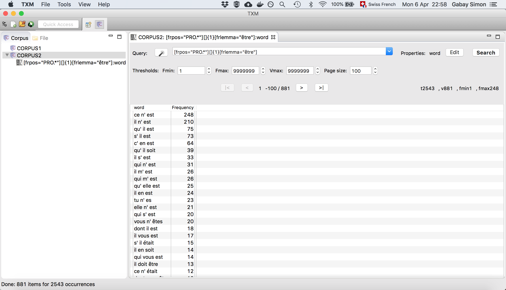

---
## Solutions
1. `[frpos="PRO.*"]`
2. `[frpos="PRO.*"][word="être"]`
3. `[frpos="PRO.*"][frlemma="être"]`
4. `[frpos="PRO.*"][][frlemma="être"]`

---
## CQL _advanced_
* Ignorer:
	* `%c` casse, ex. `[word="état"%c]`
	* `%d` diacritiques, ex. `[word="état"%d]`
	* `%d` les deux, ex., `[word="état"%cd]`
* Opérateurs
	* `=` égal
	* `!=` différent
	* `|` ou
	* `&` et
	* `()` priorité des opérations
* Quantificateurs
	* `{1}`une fois, `{1,2}`une ou deux fois
	* `?`zéro ou une fois
	* `+`une seule fois ou plus

---
* Pour des raisons informatiques, il faut échapper certains caractères (ceux utilisés par CQL) en plaçant une barre oblique inverse avant:
	* `?`, `*`, `+`, `|`, `&`
	* `?`, `*`, `+`, `|`, `&`

* On peut enfin utiliser des expressions régulières:
	* `.` n'importe quel caractère
	* `[uv]` _u_ ou _v_
	* `[uvij]` _u_ ou _v_ ou _i_ ou _j_
	* `[a-z]` n'importe quelle minuscule non accentuée
	* `[A-Z]` n'importe quelle majuscule non accentuée
	* `\d` un chiffre
	* `\s` un caractère d’espacement
	* `\w` un caractère de mot
	* Et beaucoup d'autres…
---
* Il est possible d'utiliser des propriétés de structures, c'est-à-dire d'utiliser les balises XML dans les requêtes:
	* `<l> []* [frlemma="manger"] []* </l>`
---
## Exercices
Cherchez:
1. _monseigneur_ ou _monsieur_ (essayez d'autres termes équivalents)
2. _dame_ ou _seigneur_ précédé d'un pronom possessif
3. _dame_ ou _seigneur_ précédé d'un pronom possessif ou d'un article
4. Les pronoms possessifs ou articles, un mot quelconque, puis _dame_ ou _seigneur_
5. Les pronoms possessifs ou articles, un ou deux mot quelconques, puis _dame_ ou _seigneur_
6. Les mots finissant par _er_
7. Les interjections finissant par _h_
8. Les mots avec _ette_  à la rime
9. Les vers composés de cinq ou six tokens

---
1. `[word="monseigneur"|word="monsieur"|word="seigneur"]`
2. `[frpos="DET.POS"][word="seigneur"|word="dame"]`
3. `[frpos="DET.*"][word="seigneur"|word="dame"]`
4. `[frpos="DET.POS"][][word="seigneur"|word="dame"]`
5. `[frpos="DET.POS"][]{1,2}[word="seigneur"|word="dame"]`
6. `[word=".*er"]`
7. `[word="[aeiou]h"]`
8. `<l>  [] * [word=".*ette"] </l>`
9. `<l>  [] {5,6} </l>`

---
## Exploration

Vous savez désormais faire des partitions. À l'aide des métadonnées, vous pouvez créer des partitions riches pour l'exploration et l'analyse. Essayez d'en faire:
* Par genre
* Par période
* Par auteur

---
## Metadonnées

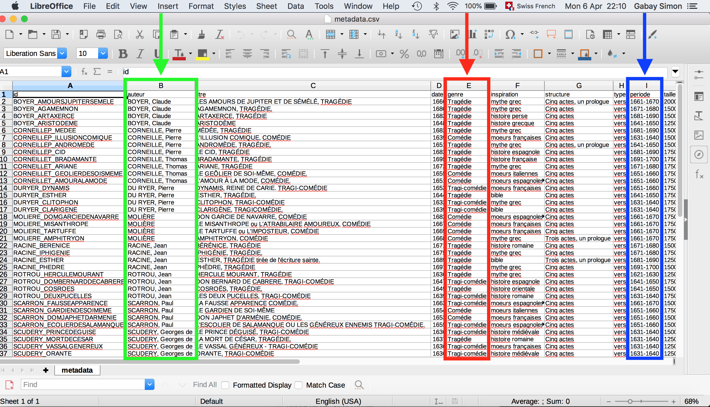

---

Pour chaque partition, partez à la découverte. Un processus d'exploration simple est:
1. création d'une table lexicale
2. Nettoyage de ladite table
3. Calculer les spécificités
4. Calculer la classification
5. Calculer l'AFC

---
## Gestion de la table lexicale

La table lexicale permet notamment de supprimer des tokens. En fonction de ce que nous allons supprimer, nous allons créer une table plus ou moins grande:
* Si nous nous apprêtons à faire une analyse de type stylométrique, et donc à ne conserver que les mots vides, il est inutile (la plupart du temps) de faire une table contenant plus de 200 mots
* Si nous nous apprêtons à faire une analyse de type textométrique, et donc à ne conserver que les mots thématiques , il va falloir faire une table un peu plus grande, probablement d'environ 500 mots.

---

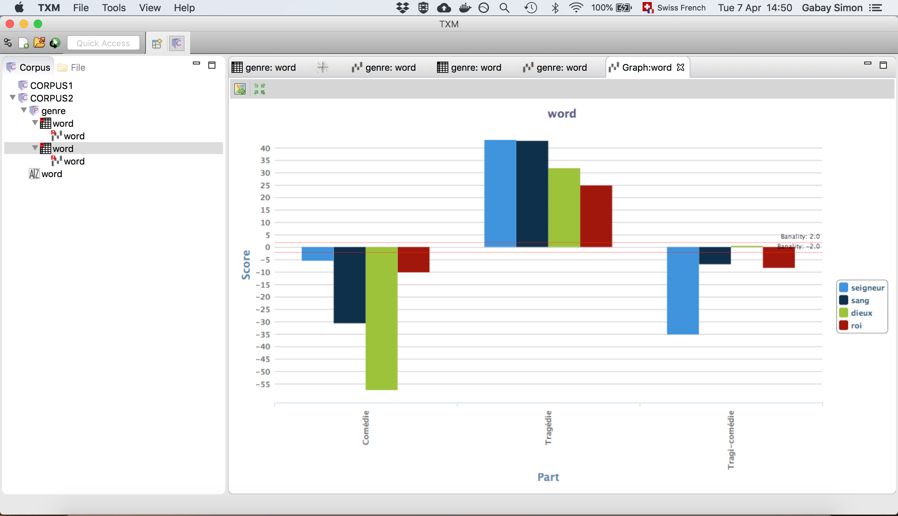

---
### Sources
Ce cours reprend un cours donné avec Jean-Baptiste Camps lors de la formation Fophil de Neuchâtel.
